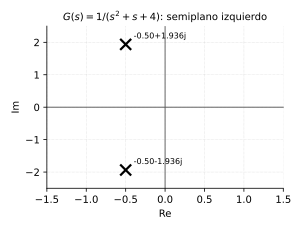
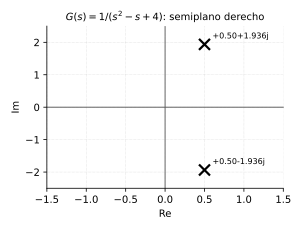
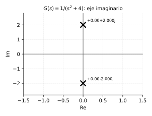

# Transformada de Laplace y respuesta temporal

*Transcripción de las páginas 6–15 del cuaderno.*

## Transformada de Laplace

$$
F(s) = \int_{0}^{\infty} e^{-st} f(t)\, dt
$$

Válida para sistemas **LTI** (lineales e invariantes en el tiempo).

### Por qué hace falta esto: de la ecuación diferencial a la función de transferencia

*Sección agregada a pedido explícito (`pendiente.txt`) — el cuaderno entra
directo a la definición de Laplace sin mostrar de dónde sale la necesidad.*

El capítulo 1 dejó planteado el modelo del sistema masa-amortiguador:

$$
m\,\frac{dv(t)}{dt} + b\,v(t) = f(t)
$$

Resolver esta ecuación diferencial a mano (para cada $f(t)$ distinta) es
tedioso. La gracia de Laplace es que convierte **derivadas en
multiplicaciones por $s$** — con condiciones iniciales nulas,
$\mathcal{L}\{dv/dt\} = s\,V(s)$. Aplicando Laplace a toda la ecuación:

$$
m\,s\,V(s) + b\,V(s) = F(s)
\qquad\Longrightarrow\qquad
V(s)\,(ms+b) = F(s)
$$

$$
\boxed{\;G(s) = \frac{V(s)}{F(s)} = \frac{1}{ms+b}\;}
$$

La ecuación diferencial se convirtió en **álgebra**: dividir por $(ms+b)$
en vez de integrar. Esta $G(s)$ es la **función de transferencia** del
sistema — la relación entre la entrada (fuerza) y la salida (velocidad) en
el dominio de Laplace, sin necesidad de resolver la ecuación diferencial
cada vez que cambia la entrada $f(t)$.

### Polos y ceros

$$
G(s) = \frac{\mathrm{Num}(s)}{\mathrm{Den}(s)}
$$

- $\mathrm{Num}(s) = 0$ → **ceros**
- $\mathrm{Den}(s) = 0$ → **polos**

**Qué significan.** Un polo es un valor de $s$ donde $G(s)\to\infty$ — el
denominador se anula. Un cero es un valor de $s$ donde $G(s)\to 0$ — el
numerador se anula. No son solo álgebra: los polos son las
**frecuencias naturales** del sistema — determinan la forma de la
respuesta libre (sin entrada), independientemente de qué se le aplique a
la entrada. Los ceros no generan modos propios, pero sí modifican **cuánto
pesa** cada modo en la respuesta total (la amplitud y el signo con que
aparece cada término).

**Ejemplo — el sistema masa-amortiguador de arriba.** $G(s)=1/(ms+b)$ tiene
un único polo en $s=-b/m$ (donde $ms+b=0$) y ningún cero finito. Ese polo
es, literalmente, la constante de tiempo del sistema: la respuesta libre
decae como $e^{-(b/m)t}$ — cuanto más grande $b/m$ (más roce, menos masa),
más rápido decae, más "adentro" del semiplano izquierdo cae el polo.

**Ejemplo con cero** — $G(s) = \dfrac{s+3}{(s+1)(s+2)}$ tiene polos en
$s=-1$ y $s=-2$ (dos modos naturales, $e^{-t}$ y $e^{-2t}$) y un cero en
$s=-3$. El cero no agrega un tercer modo — la respuesta natural sigue
siendo combinación solo de $e^{-t}$ y $e^{-2t}$ — pero cambia el peso
relativo de cada uno en la fracción parcial (comparar esta $G(s)$ con la
misma sin el $(s+3)$ en el numerador: los coeficientes $A$, $B$ de la
descomposición en fracciones parciales salen distintos).

### Estabilidad según la ubicación de los polos

| Condición | Comportamiento |
|---|---|
| $\operatorname{Re}\{s\} < 0$ | estable |
| $\operatorname{Re}\{s\} > 0$ | inestable |
| $s = \pm j\alpha$ | oscilatorio |
| un polo en $s = 0$ | integrador |
| un cero en $s = 0$ | derivador |

Variable compleja:

$$
s = \sigma + j\omega
$$

**Por qué la tabla es así — el porqué que el cuaderno no desarrolla.** Cada
polo $s_i$ contribuye a la respuesta libre un término de la forma
$e^{s_i t}$. Escribiendo $s_i = \sigma + j\omega$:

$$
e^{s_i t} = e^{(\sigma+j\omega)t} = e^{\sigma t}\cdot e^{j\omega t}
= \underbrace{e^{\sigma t}}_{\text{envolvente}}\cdot
\underbrace{\left(\cos\omega t + j\operatorname{sen}\omega t\right)}_{\text{oscilación, magnitud 1}}
$$

La parte oscilante **nunca crece ni decae** (su magnitud es siempre 1) —
toda la información de si el término crece o decae vive en $e^{\sigma t}$,
es decir, en la **parte real** del polo. De ahí sale cada fila de la
tabla:

- $\sigma = \operatorname{Re}\{s\} < 0$: $e^{\sigma t}\to 0$ — el término se
  apaga solo, el sistema es **estable**.
- $\sigma > 0$: $e^{\sigma t}\to\infty$ — el término crece sin límite,
  **inestable**.
- $\sigma = 0$ (polo en $\pm j\alpha$, puramente imaginario): la envolvente
  es constante ($e^0=1$) — ni crece ni decae, queda oscilando para
  siempre con amplitud fija. Es el caso límite, **marginalmente estable**
  (técnicamente inestable para fines de diseño: cualquier perturbación
  chiquita puede sacarlo de ahí, y en la práctica ni siquiera se sostiene
  perfecto).
- Polo en $s=0$: $e^{0\cdot t}=1$, un escalón — pero más importante,
  $1/s$ es exactamente la transformada de Laplace del **integrador**
  ($\int_0^t x(\tau)\,d\tau \;\leftrightarrow\; X(s)/s$). Un polo en el
  origen se comporta como un bloque integrador en cascada.
- Cero en $s=0$: por la misma lógica pero al revés — $s$ es el operador de
  **derivar** en Laplace ($dx/dt \leftrightarrow s\,X(s)$, con condición
  inicial nula). Un cero en el origen actúa como un derivador en cascada.

### Forma general y polinomio característico

$$
G(s) = \frac{Y(s)}{X(s)}
= \frac{b_0 s^{m} + b_1 s^{m-1} + \cdots}{a_0 s^{n} + a_1 s^{n-1} + \cdots}
$$

El denominador es el **polinomio característico**.

### En Matlab

*Sección desarrollada a pedido explícito (`pendiente.txt`) — el cuaderno
solo anota la línea de código sin decir para qué sirve ni mostrar un uso
real.*

`feedback` calcula automáticamente la función de transferencia de lazo
cerrado — hace, en una línea, exactamente la cuenta $F=G/(1+GH)$ que se
dedujo a mano en el capítulo anterior:

```matlab
[num, den] = feedback(num1, den1, num2, den2)
% num1/den1 = G(s)  (trayectoria directa)
% num2/den2 = H(s)  (realimentación; se omite si es realimentación unitaria, H=1)
% devuelve num/den = G/(1+G*H)
```

**Por qué está ahí**: a mano, multiplicar y sumar polinomios para armar
$1+G\,H$ y simplificar es tedioso y fácil de arruinar con un error de
álgebra — sobre todo con plantas de orden alto. `feedback` hace ese álgebra
sin errores, para poder concentrarse en el diseño (elegir $G$, $H$) en vez
de en la manipulación simbólica.

**Ejemplo real — armar el lazo y determinar si es estable:**

```matlab
% Planta: G(s) = 5/(s+2)
numG = 5;
denG = [1 2];

% Realimentacion unitaria: H(s) = 1
[numF, denF] = feedback(numG, denG, 1, 1);
% numF/denF = 5/(s+7)

% Determinar estabilidad: mirar donde caen los polos
p = roots(denF)
% p = -7  -> parte real negativa, sistema ESTABLE

% Verlo, no solo calcularlo: respuesta al escalon
sys = tf(numF, denF);
step(sys)
```

Con el modelo masa-amortiguador de este mismo capítulo ($G(s)=1/(ms+b)$),
el mismo patrón sirve para **diseñar**: si se le agrega una ganancia
proporcional $K$ delante de la planta ($G_c = K$, ver capítulo de PID) y
se pregunta qué tan grande puede ser $K$ antes de perder estabilidad, se
barre un rango de valores de $K$, se arma el lazo con `feedback` para cada
uno, y se mira `roots(denF)` — exactamente el tipo de barrido que hace
`rlocus` (lugar de las raíces) de forma continua en vez de punto por
punto.

---

## Funciones de transferencia en el lazo


**Función de transferencia de lazo abierto:**

$$
\frac{B(s)}{E(s)} = G(s)\,A(s)
$$

**Función de transferencia de la trayectoria directa:**

$$
\frac{Y(s)}{E(s)} = G(s)
$$

---

## Ejercicio 1 — polo real simple

$$
G(s) = \frac{Y(s)}{X(s)} = \frac{1}{s-a}
\qquad
x(t) =
\begin{cases}
1 & t > 0 \\
0 & t < 0
\end{cases}
\qquad
X(s) = \frac{1}{s}
$$

$$
Y(s) = G(s)\,X(s) = \left(\frac{1}{s-a}\right)\left(\frac{1}{s}\right)
$$

Fracciones parciales:

$$
\begin{aligned}
Y &= \frac{A}{s-a} + \frac{B}{s}
   = \frac{A\,s + B\,s - a\,B}{s\,(s-a)}
   = \frac{(A+B)\,s - a\,B}{s\,(s-a)}
   = \frac{1}{s\,(s-a)} \\[4pt]
(A+B)\,s - a\,B &= 1
\end{aligned}
$$

Igualando coeficientes:

$$
\begin{aligned}
A + B &= 0 \\
-a\,B &= 1 \quad\Longrightarrow\quad B = -\frac{1}{a},
\qquad A = \frac{1}{a}
\end{aligned}
$$

Reemplazando:

$$
Y(s) = \frac{1/a}{s-a} - \frac{1/a}{s}
\qquad\Longrightarrow\qquad
\boxed{\,y(t) = \frac{1}{a}\,e^{a t} - \frac{1}{a}\,}
$$

El cuaderno anota que hay singularidades en $s = a$ y en $s = 0$, y dibuja una
exponencial creciente — el caso $a > 0$, inestable.

## Ejercicio 2 — planteamiento con polo en $-a$

$$
Y(s) = \frac{1}{(s+a)\,s}
$$

$$
\begin{aligned}
Y &= \frac{A}{s+a} + \frac{B}{s}
   = \frac{A\,s + B\,s + a\,B}{(s+a)\,s}
   = \frac{s\,(A+B) + a\,B}{s\,(s+a)}
   = \frac{1}{s\,(s+a)} \\[4pt]
A + B &= 0, \qquad a\,B = 1
\end{aligned}
$$

*(El cuaderno deja el desarrollo aquí; el resultado sería
$y(t) = \frac{1}{a}\left(1 - e^{-a t}\right)$.)*

---

## Pares de transformadas usados

| $F(s)$ | $f(t)$ |
|---|---|
| $\dfrac{1}{s+\alpha}$ | $e^{-\alpha t}$ |
| $\dfrac{s+a}{(s+a)^2 + \omega^2}$ | $e^{-a t}\cos \omega t$ |
| $\dfrac{\omega}{(s+a)^2 + \omega^2}$ | $e^{-a t}\operatorname{sen} \omega t$ |

---

## Problema — polos complejos conjugados

$$
G(s) = \frac{1}{s^2 + s + 4}
\qquad
X(s) = \frac{1}{s}
$$

### Estabilidad

$$
s_{1,2} = -0.5 \pm j\,1.936
$$



### Caso complejo conjugado

$$
Y(s) = \frac{A}{s} + \frac{B\,s + C}{s^2 + s + 4}
$$

$$
\begin{aligned}
\frac{A s^2 + A s + 4A + B s^2 + C s}{s\,(s^2+s+4)}
 &= \frac{1}{(s^2+s+4)\,s} \\[4pt]
(A+B)\,s^2 + (A+C)\,s + 4A &= 1
\end{aligned}
$$

$$
A + B = 0, \qquad A + C = 0, \qquad 4A = 1
$$

$$
A = \tfrac{1}{4}, \qquad C = -\tfrac{1}{4}, \qquad B = -\tfrac{1}{4}
$$

El cuaderno anota aquí: *parte real del polo → respuesta natural; parte
imaginaria → respuesta forzada.*

$$
Y(s) = \frac{1/4}{s} + \frac{-\tfrac{1}{4}s - \tfrac{1}{4}}{s^2+s+4}
$$

### Completar cuadrados

$$
s^2 + s + \tfrac{1}{4} - \tfrac{1}{4} + 4
= \left(s + \tfrac{1}{2}\right)^2 - \tfrac{1}{4} + 4
= \left(s + \tfrac{1}{2}\right)^2 + \tfrac{15}{4}
$$

### Ajuste al par coseno–seno

$$
\frac{-\tfrac{1}{4}\,(s+1)}{\left(s+\tfrac12\right)^2 + \tfrac{15}{4}}
= \frac{-\tfrac{1}{4}\left[\left(s+\tfrac12\right) + \tfrac12\right]}
        {\left(s+\tfrac12\right)^2 + \tfrac{15}{4}}
$$

El segundo término se multiplica y divide por $\sqrt{15/4} = \sqrt{15}/2$ para
dejarlo en la forma $\omega/\left[(s+a)^2+\omega^2\right]$:

$$
\frac{\tfrac12}{\sqrt{15}/2} = \frac{1}{\sqrt{15}}
$$

### Resultado

$$
Y(s) = \frac{1/4}{s}
- \frac{1}{4}\left[
\frac{s + \tfrac12}{\left(s+\tfrac12\right)^2 + \tfrac{15}{4}}
+ \frac{1}{\sqrt{15}}\cdot
\frac{\sqrt{15}/2}{\left(s+\tfrac12\right)^2 + \tfrac{15}{4}}
\right]
$$

Antitransformando:

$$
\boxed{\;
y(t) = \frac{1}{4}
- \frac{1}{4}\left[
e^{-t/2}\cos\frac{\sqrt{15}}{2}t
+ \frac{1}{\sqrt{15}}\,e^{-t/2}\operatorname{sen}\frac{\sqrt{15}}{2}t
\right]\;}
$$

---

## Tarea — polos en el semiplano derecho

$$
G(s) = \frac{1}{s^2 - s + 4}
\qquad
X(s) = \frac{1}{s}
$$

*(En la misma hoja aparece también $G(s) = 1/(s^2+4)$, que se resuelve más
abajo como segundo ejercicio.)*



### Solución

$$
Y(s) = G(s)\,X(s) = \frac{1}{s^2-s+4}\cdot\frac{1}{s}
$$

$$
Y(s) = \frac{A}{s} + \frac{B\,s + C}{s^2 - s + 4}
= \frac{A s^2 - A s + 4A + B s^2 + C s}{s\,(s^2-s+4)}
= \frac{(A+B)\,s^2 + (C-A)\,s + 4A}{s\,(s^2-s+4)}
$$

$$
\begin{aligned}
A + B &= 0 \quad\Longrightarrow\quad A = -B \\
C - A &= 0 \quad\Longrightarrow\quad C = A \\
4A &= 1 \quad\Longrightarrow\quad A = \tfrac14 = C, \qquad B = -\tfrac14
\end{aligned}
$$

$$
Y(s) = \frac{1/4}{s} + \frac{-\tfrac14 s + \tfrac14}{s^2-s+4}
     = \frac{1/4}{s} - \frac{\tfrac14 s - \tfrac14}{s^2-s+4}
$$

### Completar cuadrados

$$
2\gamma = -1 \;\Longrightarrow\; \gamma = -\tfrac12, \quad \gamma^2 = \tfrac14
$$

$$
s^2 - s + \tfrac14 - \tfrac14 + \tfrac{16}{4}
= \left(s - \tfrac12\right)^2 + \tfrac{15}{4}
$$

$$
\begin{aligned}
Y(s) &= \frac{1}{4}\left[
\frac{1}{s} - \frac{s-1}{\left(s-\tfrac12\right)^2 + \tfrac{15}{4}}\right] \\[4pt]
&= \frac{1}{4}\left[
\frac{1}{s} - \frac{\left(s-\tfrac12\right) - \tfrac12}
                    {\left(s-\tfrac12\right)^2 + \tfrac{15}{4}}\right] \\[4pt]
&= \frac{1}{4}\left[
\frac{1}{s}
- \frac{s-\tfrac12}{\left(s-\tfrac12\right)^2 + \tfrac{15}{4}}
+ \frac{\tfrac12}{\left(s-\tfrac12\right)^2 + \tfrac{15}{4}}\right]
\end{aligned}
$$

El último término se normaliza igual que antes, multiplicando y dividiendo por
$\sqrt{15}/2$.

### Resultado del cuaderno

$$
y(t) = \frac{1}{4}
- e^{t/2}\cos\frac{\sqrt{15}}{2}t
- e^{t/2}\operatorname{sen}\frac{\sqrt{15}}{2}t
$$

La exponencial es **creciente** ($e^{+t/2}$), coherente con los polos en
$+\tfrac12 \pm j\tfrac{\sqrt{15}}{2}$: el sistema es inestable.

## Segundo ejercicio — polos sobre el eje imaginario

$$
Y(s) = \frac{1}{(s^2+4)\,s}
$$



$$
Y(s) = \frac{A}{s} + \frac{B\,s + C}{s^2+4}
= \frac{A s^2 + 4A + B s^2 + C s}{s\,(s^2+4)}
$$

$$
(A+B)\,s^2 + C\,s + 4A = 1
$$

$$
A + B = 0 \;\Longrightarrow\; A = -B,
\qquad C = 0,
\qquad 4A = 1 \;\Longrightarrow\; A = \tfrac14
$$

$$
Y(s) = \frac{1/4}{s} - \frac{\tfrac14 s}{s^2+4}
     = \frac{1}{4}\left[\frac{1}{s} - \frac{s}{s^2+4}\right]
$$

### Completar cuadrado

$$
(s+0)^2 + 4
\qquad\Longrightarrow\qquad
Y(s) = \frac{1}{4}\left[\frac{1}{s} - \frac{s+0}{(s+0)^2+4}\right]
$$

$$
\boxed{\;
y(t) = \frac{1}{4}\left[1 - \cos 2t\right]
     = \frac{1}{4} - \frac{\cos 2t}{4}\;}
$$

Oscilación sostenida, sin envolvente que decaiga ni crezca: es el caso
marginal de los polos sobre el eje imaginario.
