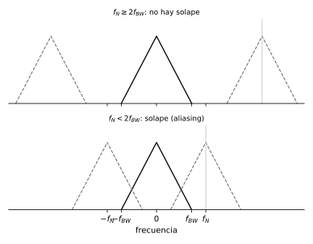

# Modelado, ganancias y respuesta en frecuencia

*Transcripción de las páginas 16–20, 25 y 26 del cuaderno.*

## Modelado de un circuito RC

Ecuaciones en el tiempo:

$$
V_{in}(t) = V_C(t) + I(t)\,R
\qquad
I(t) = C\,\frac{dV_C(t)}{dt}
$$

Aplicando Laplace:

$$
V_{in}(s) = V_C(s) + I(s)\,R
\qquad
I(s) = C\,s\,V_C(s)
$$

$$
\begin{aligned}
V_{in}(s) &= \frac{I(s)}{C s} + I(s)\,R \\[4pt]
V_{in}(s) &= \frac{I(s)\left[1 + sRC\right]}{C s}
\end{aligned}
$$

$$
\boxed{\;\frac{I(s)}{V_{in}(s)} = \frac{C s}{1 + C s R}\;}
$$

---

## Ganancia estática

Aplica para funciones de transferencia **estables y sin integrador**.

$$
K_{st} = \lim_{s \to 0} G(s)
$$

Permite conocer el valor en estado estable de un sistema ante una entrada
escalón:

$$
y_{ss} = K_{st}\,x_{ss}
\qquad (x_{ss}: \text{entrada escalón})
$$

El cuaderno dibuja la curva $y_{ss}$ frente a $x_{ss}$: una recta **ideal** de
pendiente $\Delta y / \Delta x$ que en el caso **real** se aparta por
saturación, con una *zona muestra* marcada al inicio.

## Ganancia de velocidad

Aplica a sistemas **estables con integrador**.

$$
y_{\text{pend. salida}} = K_v\,x_{ss}
\qquad (x_{ss}: \text{escalón})
$$

$$
K_v = \lim_{s \to 0} s\,G(s)
$$

### Aplicando el límite al ejercicio de la clase 1

$$
K_{st} = \lim_{s \to 0} \frac{s+3}{(s+2)(s^2+s+8)} = \frac{3}{16}
$$

$$
y_{ss} = \frac{3}{16} \times 1 = \frac{3}{16} = 0.188
$$

### Cálculo de $K_v$

$$
K_v = \lim_{s \to 0} s\,G(s)
= \lim_{s \to 0} s\,\frac{s+3}{s\,(s^2+s+8)}
= \frac{3}{8}
$$

$$
y_{\text{pend.}} = \frac{3}{8} \times 1 = \frac{3}{8}
$$

El cuaderno anota: *la parte derivativa reduce el error en estado estable.*

---

## Especificaciones de la respuesta temporal

**Tiempo de estabilización (settling time).** Tiempo en el cual la oscilación
de la señal es menor al 2 % de su valor $y_{ss}$. Depende de la ubicación de
los polos.

**Tiempo de levantamiento (rise time).** Tiempo que tarda la señal en pasar
del 10 % al 90 % de su valor en estado estable.

**Sobrepaso (peak response).** Máximo valor que va a tener la señal, en
porcentaje, calculado respecto a su valor en estado estable:

$$
\%\,M_p = \frac{y_p - y_{ss}}{y_{ss}} \times 100
$$

Es normal hasta un 20 % de sobrepico.

---

## Diagrama de Bode

El cuaderno dibuja las dos curvas: magnitud $|G|$ en dB y fase $\angle G$,
ambas contra la frecuencia.

Ante una entrada senoidal, un sistema LTI responde con una senoide de la misma
frecuencia, distinta amplitud y desfasada:

$$
x(t) = A\operatorname{sen}(\omega t)
\;\longrightarrow\;
\boxed{G}
\;\longrightarrow\;
y(t) = B\operatorname{sen}(\omega t + \varphi)
$$

$$
|G| = \frac{B}{A} \quad (\text{ganancia})
$$

### Ganancia en dB

$$
|G|_{dB} = 20 \log_{10}|G|
$$

### Ejercicio

$$
G(s) = \frac{1}{s+3}
\qquad
G(s = j\omega) = \frac{1}{j\omega + 3}
$$

$$
|G(j\omega)| = \frac{1}{\sqrt{\omega^2 + 9}}
\qquad
\angle G(j\omega) = 0 - \tan^{-1}\!\left(\frac{\omega}{3}\right)
$$

---

## Ejercicio de respuesta en frecuencia y periodo de muestreo

$$
G(s) = 4 \cdot \frac{3s+2}{(s+1)^3}
$$

Magnitud y fase evaluadas en $s = j\omega$:

$$
|G(j\omega)| = \frac{4\sqrt{4 + 9\omega^2}}
{\sqrt{1+\omega^2}\,\sqrt{1+\omega^2}\,\sqrt{1+\omega^2}}
$$

$$
\angle G(j\omega) = \tan^{-1}\!\left(\frac{3\omega}{2}\right)
- \tan^{-1}(\omega) - \tan^{-1}(\omega) - \tan^{-1}(\omega)
$$

Nota al margen: si el denominador tiene una $s$, como en
$\dfrac{1}{s(s+a)}$, hay **integrador**.

### Amplitud o ganancia estática

$$
K_{st} = \lim_{s \to 0} \frac{4(s+2)}{(s+1)^3} = 8
$$

$$
|G_{dB}| = 20\log_{10}(8) = 18.1
$$

### Frecuencia de corte y periodo de muestreo

Para hallar la frecuencia de corte se baja al 70 %, es decir $-3$ dB. Del
gráfico de Bode de MATLAB: $\omega \approx 0.88$ rad/s.

$$
\boxed{\;\omega_s = 10\,(2\,\omega_{-3dB}) = 20\,\omega_{-3dB}\;}
$$

$$
\omega_s = 17.6 \;\text{rad/s} = \frac{2\pi}{T}
\qquad\Longrightarrow\qquad
T = 0.35\;\text{s}
$$

### Segundo ejercicio (misma planta sin el factor 4)

$$
G(s) = \frac{3s+2}{(s+1)^3}
\qquad
K_{st} = \lim_{s \to 0}\frac{3s+2}{(s+1)^3} = 2
$$

$$
|G_{dB}| = 20\log(2) = 6.02
\qquad
\omega_c = 0.865\;\text{rad/s}
$$

$$
\omega_s = 20 \times 0.865 = 17.3\;\text{rad/s}
\qquad
T = \frac{2\pi}{17.3} = 0.363\;\text{s}
$$

Regla equivalente que el cuaderno encuadra:

$$
\boxed{\;T = \frac{\pi}{10\,\omega}\;}
$$

### Tercer caso (denominador al cuadrado)

$$
G(s) = \frac{3s+2}{(s+1)^2} \;\to\; K_{st} = 2
\qquad
|G_{dB}| = 20\log(2) = 6.02
$$

$$
\omega_{-3dB} = 1.67\;\text{rad/s}
\qquad
T = \frac{2\pi}{20 \times 1.67} = 0.18\;\text{s}
$$

---

## Periodo de muestreo: criterio de Nyquist

$$
f_s \geq 2 f_{BW}
\qquad\text{o, en frecuencia angular,}\qquad
\omega_s \geq 2\,\omega_{BW} \;\;(\text{rad/s})
$$

Del solape de las réplicas sale la condición:

$$
f_N - f_{BW} \geq f_{BW}
\qquad\Longrightarrow\qquad
f_N \geq 2 f_{BW}
$$
