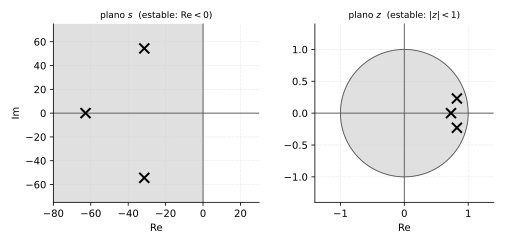

# Transformada Z y mapeo de polos y ceros

*Transcripción de las páginas 23, 24 y 27–30 del cuaderno.*

## Transformada Z

$$
H(z) = \frac{Y(z)}{X(z)}
$$

La señal continua se toma muestreada:

$$
x(t) \;\longrightarrow\; x(kT)
\qquad (T: \text{periodo de muestreo})
$$

### Estabilidad

El semiplano izquierdo del plano $s$ se corresponde con el interior del
círculo unitario del plano $z$, con

$$
z = r\,e^{j\omega}
$$



### Forma factorizada

$$
H(z) = \frac{b_0}{a_0}\, z^{\,N-M}\,
\frac{(z-z_1)(z-z_2)\cdots(z-z_n)}{(z-p_1)(z-p_2)\cdots(z-p_n)}
$$

- $M$ ceros: $z_1, z_2, \ldots, z_n$
- $N$ polos: $p_1, p_2, \ldots, p_n$
- Ganancia: $\dfrac{b_0}{a_0}$ — factor de amplificación, $K$

---

## Mapeo de polos y ceros

Relación entre un polo (o cero) del plano $s$ y su imagen en el plano $z$:

$$
z_i = e^{T s_i}
\qquad\Longleftrightarrow\qquad
s_i = \frac{1}{T}\ln z_i
$$

### Reglas, dada una función $G(s)$

1. Todo polo y cero (existente) de $G(s)$ se ve reflejado en el plano $z$ con
   la relación $z_i = e^{Ts_i}$.
2. Los **ceros en el infinito** de $G(s)$ se ven reflejados en el plano $z$ en
   $z_i = -1$. Si existieran $r$ ceros en el infinito, entonces hay
   $(z_i + 1)^{\,r-1}$ ceros en $G(z)$.
3. Si la planta $G(s)$ **no** presenta integrador, se debe cumplir:

$$
\lim_{s \to 0} G(s) = \lim_{z \to 1} G(z)
$$

   Si la planta **sí** presenta integrador:

$$
\lim_{s \to 0} s\,G(s)
= \lim_{z \to 1} \left(\frac{z-1}{z}\right)\frac{1}{T}\,G(z)
$$

Se define como ceros en el infinito a la diferencia entre el número de polos y
el número de ceros finitos de $G(s)$:

$$
r = n - m
\qquad
n = \#\,\text{polos}, \quad m = \#\,\text{ceros}
$$

---

## Ejercicio de mapeo

Código: `clase-control_mapeo.m`

De la gráfica se obtiene $\omega = 62.4$ rad/s, y de ahí el periodo de
muestreo:

$$
T = \frac{\pi}{624} = 5.03\;\text{ms}
$$

Con MATLAB se hallan los polos (figura 2, `pzmap(gf)`):

$$
s_1 = -62.8
\qquad
s_{2,3} = -31.4 \pm 54.4j
$$

### 1. Polos al plano $z$ con $z_i = e^{T s_i}$

$$
e^{(0.005)(-62.8)} = 0.7305
$$

$$
e^{(0.005)(-31.4 \pm 54.4j)} = e^{-0.157 \pm 0.272j}
$$

Pasando a rectangular:

$$
e^{-0.157}\left[\cos(0.272) + j\operatorname{sen}(0.272)\right]
= 0.8233 \pm 0.2296j
$$

### 2. Ceros en el infinito

$$
r = 3 - 0 = 3
\qquad\Longrightarrow\qquad
(z+1)^{\,r-1} = (z+1)^2
$$

### 3. Condición de ganancia

$$
\lim_{s \to 0} G(s) = \lim_{z \to 1} G(z) \;\longrightarrow\; K
$$

$$
G(z) = \frac{K\,(z+1)^2}
{(z - 0.7305)\,(z^2 - 1.6466z + 0.7305)}
$$

### Reconstruir el binomio a partir de un par complejo

$$
s^2 - 2\,\mathrm{Re}\,s + \mathrm{Re}^2 + \mathrm{Im}^2
$$

Ejemplo, para $-2 \pm 3j$:

$$
s^2 - 2(-2)\,s + (-2)^2 + (3)^2
= s^2 + 4s + 13
$$

### Cálculo de $K$

Imponiendo ganancia unitaria en continua:

$$
\lim_{s \to 0} = 1
\qquad\Longrightarrow\qquad
1 = \frac{4K}{(0.2693)(0.0839)}
$$

$$
K = \frac{(0.2693)(0.0839)}{4} = 5.65\times 10^{-3}
$$

<!-- Nota fig. NOTAS-DESARROLLO.md #14: el cuaderno anota 5.1637e-3; con los
     datos de la misma hoja da 5.65e-3. Corregido, ver NOTAS-DESARROLLO.md. -->

### Verificación por MATLAB

```matlab
gFz = c2d(gF, T, 'matched')
zpk(gFz)
```

---

## Retenedores: de una secuencia de muestras a una señal continua

*Tema del temario (Unidad 1) que no llegó a aparecer en el cuaderno — se
completa acá porque el ejemplo siguiente ya usa un retenedor de orden cero
sin explicarlo.*

Un DAC (convertidor digital-analógico) no puede entregar los impulsos
matemáticos $x(kT)\,\delta(t-kT)$ que salen del muestreo ideal — tiene que
producir una señal continua real. El **retenedor** es el bloque que hace esa
reconstrucción: toma cada muestra y la mantiene (o la extrapola) hasta que
llega la siguiente.

### Retenedor de orden cero (ZOH)

El más simple y el que usa la inmensa mayoría del hardware real: mantiene el
valor de la muestra actual **constante** hasta la próxima muestra (una
"escalera").

Para una sola muestra de altura 1 en $t=0$, la salida del ZOH es un pulso
rectangular de ancho $T$:

$$
g_{h0}(t) = u(t) - u(t - T)
$$

Con la propiedad de traslación de Laplace ($u(t-T) \to e^{-Ts}/s$):

$$
\boxed{\;
G_{h0}(s) = \frac{1 - e^{-Ts}}{s}
\;}
$$

Esta es exactamente la expresión que ya se usó en el ejemplo de la sección
siguiente, sin derivarla.

**Respuesta en frecuencia.** Evaluando en $s=j\omega$:

$$
G_{h0}(j\omega) = T\,e^{-j\omega T/2}\,\operatorname{sinc}\!\left(\frac{\omega T}{2}\right)
\qquad \left(\operatorname{sinc}(x) = \frac{\operatorname{sen} x}{x}\right)
$$

Dos consecuencias prácticas:

- **Magnitud**: cae como $\operatorname{sinc}$, con el primer cero en
  $\omega = \omega_s = 2\pi/T$ — el ZOH actúa como un filtro pasabajas
  burdo, coherente con que "rellena" el hueco entre muestras.
- **Fase**: $-\omega T/2$, un retardo de fase **lineal** equivalente a
  medio periodo de muestreo ($T/2$). Es el "medio retardo de muestreo" que
  se menciona en textos de control digital al explicar por qué el ZOH
  empeora el margen de fase de un lazo cerrado.

### Retenedor de orden uno (FOH)

En vez de mantener el valor constante, el FOH **extrapola linealmente**
usando la pendiente entre la muestra actual y la anterior — geométricamente,
sigue prediciendo la recta que traía la señal.

Su función de transferencia (no se deduce aquí, es un resultado estándar
que combina dos ZOH desfasados para armar la rampa):

$$
G_{h1}(s) = \frac{1 + Ts}{T}\left(\frac{1 - e^{-Ts}}{s}\right)^{2}
$$

**¿Por qué casi nadie usa el FOH en la práctica?** Reconstruye mejor la
*forma* de la señal (menos escalonada), pero:

1. Necesita conocer la muestra anterior además de la actual (un retardo
   extra de procesamiento).
2. Al extrapolar con la pendiente, amplifica el ruido de alta frecuencia
   entre muestras (una pendiente calculada de una diferencia es sensible al
   ruido).
3. Su fase cae más rápido que la del ZOH, empeorando más el margen de fase.

Por eso el ZOH —aunque "peor" para reconstruir la forma— es el que
implementa casi todo el hardware real: es más simple y más robusto al
ruido.

### Ejercicio: discretizar una planta con ZOH

Plantear $G(z)$ para $G(s) = \dfrac{1}{s+2}$ con $T = 0.5$ y retenedor de
orden cero, usando la fórmula estándar
$G(z) = (1-z^{-1})\,\mathcal{Z}\!\left[\dfrac{G(s)}{s}\right]$:

$$
\frac{G(s)}{s} = \frac{1}{s(s+2)} = \frac{1}{2}\left[\frac{1}{s} - \frac{1}{s+2}\right]
\qquad\text{(fracciones parciales)}
$$

Con los pares ya vistos ($1/s \to z/(z-1)$ del escalón, y
$1/(s+a) \to z/(z-e^{-aT})$ de la exponencial, cap. 10):

$$
\mathcal{Z}\!\left[\frac{G(s)}{s}\right]
= \frac{1}{2}\left[\frac{z}{z-1} - \frac{z}{z-e^{-2T}}\right]
$$

$$
G(z) = \frac{z-1}{z}\cdot\frac{1}{2}\left[\frac{z}{z-1} - \frac{z}{z-e^{-2T}}\right]
= \frac{1}{2}\left[1 - \frac{z-1}{z-e^{-2T}}\right]
$$

Con $T=0.5$: $e^{-2(0.5)} = e^{-1} = 0.3679$.

$$
G(z) = \frac{1}{2}\cdot\frac{(z-0.3679) - (z-1)}{z - 0.3679}
= \frac{1}{2}\cdot\frac{0.6321}{z-0.3679}
$$

$$
\boxed{\;G(z) = \dfrac{0.3161}{z - 0.3679}\;}
$$

---

## Ejemplo: sistema de control muestreado


Con $T = 1$, retenedor de orden cero y planta con retardo:

$$
G(z) = \frac{\left(1 - e^{-Ts}\right)K\,e^{-1.25 s}}{s^2\,(s+1)}
$$

$$
G(z) = 0.2223\,K\;
\frac{(z + 1.755)(z + 0.03)}{z^2\,(z-1)\,(z-0.368)}
$$

### Rutina MATLAB

```matlab
G = zpk([-0.03 -1.755], [0, 0, 1, 0.368], [0.2223], 1)
rlocus(G)
```

---

## Transformación bilineal

*Tema del temario (Unidad 1) que tampoco llegó a aparecer en el cuaderno.
Es el método alternativo a $z=e^{Ts}$ que se usó en todo este capítulo para
mapear polos uno por uno.*

### De dónde sale

La idea es aproximar la integración (el bloque $1/s$) por la regla
trapezoidal: el área bajo $x(t)$ entre dos muestras se aproxima como un
trapecio, no como un rectángulo.

$$
y(kT) \approx y((k-1)T) + \frac{T}{2}\big[x(kT) + x((k-1)T)\big]
$$

Pasando a $z$ ($y(kT)\to Y(z)$, $y((k-1)T) \to z^{-1}Y(z)$, etc.) y
despejando $Y(z)/X(z) = 1/s$:

$$
Y(z)\left(1 - z^{-1}\right) = \frac{T}{2}\,X(z)\left(1+z^{-1}\right)
\quad\Longrightarrow\quad
\frac{1}{s} \approx \frac{T}{2}\cdot\frac{z+1}{z-1}
$$

$$
\boxed{\;
s = \frac{2}{T}\cdot\frac{z-1}{z+1}
\qquad\Longleftrightarrow\qquad
z = \frac{1 + sT/2}{1 - sT/2}
\;}
$$

### Por qué es útil (y qué cuidado exige)

- **Preserva la estabilidad exactamente**: todo el semiplano izquierdo
  ($\operatorname{Re}(s)<0$) mapea al interior exacto del círculo unitario,
  igual que $z=e^{Ts}$ — pero acá es una simple sustitución algebraica en
  $G(s)$, no hay que factorizar ni mapear polo por polo. Por eso es el
  método que suelen usar las herramientas de software (`c2d` con el modo
  `'tustin'` en MATLAB) para discretizar controladores diseñados en $s$.
- **Distorsiona el eje de frecuencia** ("*frequency warping*"): la relación
  entre la frecuencia continua $\omega$ y la digital $\Omega=\omega T$ no es
  lineal, sino $\omega = \frac{2}{T}\tan(\Omega/2)$. Para diseño de filtros
  donde importa una frecuencia crítica exacta (ej. un corte de Bode) se
  "pre-distorsiona" esa frecuencia antes de aplicar la transformación, para
  que caiga en el lugar correcto después del mapeo.

### Ejercicio: comparar contra el mapeo exacto

Mismo sistema que en el ejercicio de ZOH de arriba: $G(s) = 1/(s+2)$,
$T=0.5$. Sustituyendo $s = \frac{2}{T}\frac{z-1}{z+1} = 4\,\frac{z-1}{z+1}$:

$$
G(z) = \frac{1}{4\,\dfrac{z-1}{z+1} + 2}
= \frac{z+1}{4(z-1) + 2(z+1)}
= \frac{z+1}{6z - 2}
$$

$$
\boxed{\;G(z) = \dfrac{1}{6}\cdot\dfrac{z+1}{z - 1/3}\;}
$$

El polo queda en $z=0.333$. El mapeo exacto del ejercicio de ZOH daba el
polo en $z=e^{-1}=0.3679$ para la **misma** planta y el mismo $T$ — parecido
pero no igual: la bilineal es una *aproximación* de la dinámica muestreada,
mientras que $z=e^{Ts}$ es exacta para la ubicación del polo (por eso se usó
esa en todo el capítulo). La diferencia se reduce a medida que $T$ se hace
más chico frente a la dinámica del sistema.
