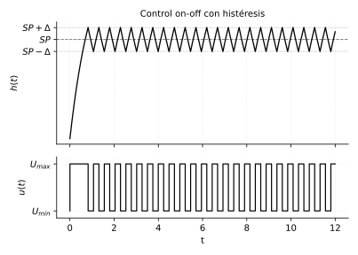

# Lazo cerrado, PID y control on-off

*Transcripción de las páginas 21 y 22 del cuaderno.*

## Lazo cerrado con controlador

$$
\frac{Y(s)}{R(s)} = \frac{G_c(s)\,G(s)}{1 + G_c(s)\,G(s)}
$$

## Control PID

En el tiempo:

$$
u(t) = K\left[\,e(t)
+ \frac{1}{T_i}\int e(t)\,dt
+ T_d\,\frac{de(t)}{dt}\,\right]
$$

Aplicando Laplace:

$$
U(s) = K\left[\,E(s)
+ \frac{1}{T_i}\,\frac{E(s)}{s}
+ T_d\,s\,E(s)\,\right]
$$

Función de transferencia del controlador:

$$
\boxed{\;
G_c = \frac{U(s)}{E(s)}
= K\left[\,1 + \frac{1}{T_i}\,\frac{1}{s} + T_d\,s\,\right]
\;}
\qquad \text{(PID)}
$$

## Control on-off

El cuaderno dibuja la señal de control $u(t)$ conmutando entre $U_{max}$ y
$U_{min}$, y la variable $h(t)$ subiendo hacia el *setpoint* y oscilando
alrededor de él.

## Control on-off con histéresis

Se define una banda alrededor del *setpoint*: $SP + \Delta$ y $SP - \Delta$.
La salida conmuta a $U_{min}$ al superar el límite superior y vuelve a
$U_{max}$ al caer por debajo del límite inferior, de modo que $u(t)$ no
conmuta de forma continua.

*(La figura reproduce el trazo del cuaderno simulando una planta de primer
orden; los valores de $\Delta$ y de la constante de tiempo son ilustrativos.)*
