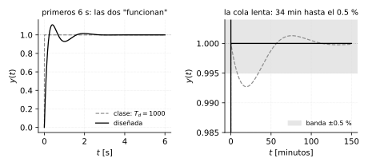
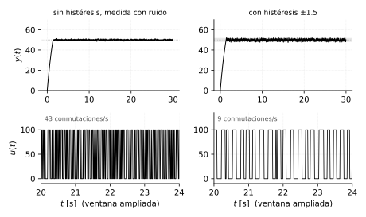

# Lazo cerrado, PID y control on-off

*Transcripción de las páginas 21 y 22 del cuaderno.*

## Lazo cerrado con controlador


$$
\frac{Y(s)}{R(s)} = \frac{G_c(s)\,G(s)}{1 + G_c(s)\,G(s)}
$$

## Control PID

En el tiempo:

$$
u(t) = K\left[\,e(t)
+ \frac{1}{T_i}\int e(t)\,dt
+ T_d\,\frac{de(t)}{dt}\,\right]
$$

Aplicando Laplace:

$$
U(s) = K\left[\,E(s)
+ \frac{1}{T_i}\,\frac{E(s)}{s}
+ T_d\,s\,E(s)\,\right]
$$

Función de transferencia del controlador:

$$
\boxed{\;
G_c = \frac{U(s)}{E(s)}
= K\left[\,1 + \frac{1}{T_i}\,\frac{1}{s} + T_d\,s\,\right]
\;}
\qquad \text{(PID)}
$$

## Sintonización del PID

*Tema explícito de la Unidad 3 del temario que no llegó a aparecer en el
cuaderno — se completa acá porque es, literalmente, el objetivo declarado
de esa unidad: tener el PID no alcanza, hay que saber elegir $K$, $T_i$,
$T_d$.*

Las reglas de **Ziegler-Nichols** (1942) siguen siendo el punto de partida
más enseñado: no dan el ajuste óptimo, pero dan un punto de arranque
razonable a partir de mediciones simples de la planta.

### Método 1 — curva de reacción (lazo abierto)

Se aplica a plantas **estables sin integrador** que responden a un escalón
con forma de "S" (sobreamortiguadas o con retardo) — exactamente el
`Modelo sobreamortiguado` $K e^{-T_d s}/(\tau s+1)$ que ya se planteó en el
capítulo de identificación.

Del ensayo a lazo abierto se miden tres números sobre la curva de reacción:
$K$ (ganancia estática, $y_{ss}/x_{ss}$), $L$ (retardo aparente, donde la
tangente en el punto de inflexión corta al eje de tiempo) y $\tau$
(constante de tiempo, desde ese cruce hasta donde la tangente llega a
$y_{ss}$).

| Controlador | $K_p$ | $T_i$ | $T_d$ |
|---|---|---|---|
| P | $\tau/(KL)$ | — | — |
| PI | $0.9\,\tau/(KL)$ | $L/0.3$ | — |
| PID | $1.2\,\tau/(KL)$ | $2L$ | $0.5L$ |

**Ejemplo.** Ensayo da $K=2$, $L=0.5\,\text{s}$, $\tau=2\,\text{s}$. Para
PID:

$$
K_p = \frac{1.2\,(2)}{(2)(0.5)} = 2.4
\qquad
T_i = 2(0.5) = 1\,\text{s}
\qquad
T_d = 0.5(0.5) = 0.25\,\text{s}
$$

### Método 2 — ganancia última (lazo cerrado)

Se usa cuando no se puede (o no conviene) sacar la planta de operación para
un ensayo a lazo abierto. Con solo control **proporcional** ($T_i\to\infty$,
$T_d=0$) en el lazo, se sube $K_p$ hasta que la salida oscile de forma
**sostenida** (ni crece ni decae) — ese es el punto de estabilidad marginal
visto en el criterio de Routh/margen de ganancia. Se registran:
$K_u$ (ganancia última, la $K_p$ a la que empezó a oscilar) y $P_u$
(periodo de esa oscilación).

| Controlador | $K_p$ | $T_i$ | $T_d$ |
|---|---|---|---|
| P | $0.5\,K_u$ | — | — |
| PI | $0.45\,K_u$ | $P_u/1.2$ | — |
| PID | $0.6\,K_u$ | $P_u/2$ | $P_u/8$ |

**Ejemplo.** Se encuentra oscilación sostenida en $K_u=4$, con
$P_u=2\,\text{s}$. Para PID:

$$
K_p = 0.6(4) = 2.4
\qquad
T_i = \frac{2}{2} = 1\,\text{s}
\qquad
T_d = \frac{2}{8} = 0.25\,\text{s}
$$

(Es coincidencia que salga igual al ejemplo anterior — son dos plantas
distintas con dos métodos distintos; se eligieron los datos para que el
resultado fuera fácil de comparar entre tablas.)

**Cuándo usar cuál**: la curva de reacción es más segura (no hay que llevar
el sistema al borde de la inestabilidad a propósito), pero requiere poder
ensayar a lazo abierto. La ganancia última se usa cuando eso no es posible,
con la planta ya operando en lazo cerrado — con el cuidado de no dejar la
oscilación sostenida corriendo más tiempo del necesario para medir $P_u$.

### El problema del *windup*

La acción integral sigue acumulando error mientras exista, **incluso si el
actuador ya se saturó** (una válvula 100 % abierta, un PWM al 100 %) y no
puede entregar más señal de control real. El integrador sigue creciendo por
dentro sin que la salida real cambie — al "enrollarse" (*windup*) acumula un
término enorme, y cuando el error finalmente cambia de signo, el sistema
tarda en "desenrollarse" antes de reaccionar: se ve como un sobrepaso
grande y lento, muy por encima de lo que predice el modelo lineal del PID.

**Anti-windup por saturación (clamping)**, la solución más simple: cuando la
salida del controlador se satura, se **detiene la integración** (no se suma
más error al integrador) hasta que la salida vuelve a estar dentro de rango.
Esquemas más finos (*back-calculation*) restan del integrador la diferencia
entre la salida calculada y la salida realmente aplicada, para que el
integrador "sepa" que se saturó y se corrija más rápido — pero el clamping
ya resuelve la mayoría de los casos prácticos con control on/off o PWM.

## Control on-off

El cuaderno dibuja la señal de control $u(t)$ conmutando entre $U_{max}$ y
$U_{min}$, y la variable $h(t)$ subiendo hacia el *setpoint* y oscilando
alrededor de él.

## Control on-off con histéresis

Se define una banda alrededor del *setpoint*: $SP + \Delta$ y $SP - \Delta$.
La salida conmuta a $U_{min}$ al superar el límite superior y vuelve a
$U_{max}$ al caer por debajo del límite inferior, de modo que $u(t)$ no
conmuta de forma continua.


*(La figura reproduce el trazo del cuaderno simulando una planta de primer
orden; los valores de $\Delta$ y de la constante de tiempo son ilustrativos.)*

## Los scripts de clase, rehechos en Python

*Dos archivos de la materia corresponden a este capítulo: `clase2.m` (un
PID sobre una planta de tercer orden) y `clase4.slx` (un lazo on-off con
ruido en la medida). Los dos se rehacen acá con Python, y los dos dejan
una lección que no es la que parece a primera vista.*

### `clase2.m`: por qué esas ganancias no son una sintonía

```matlab
s = tf('s');
g = (s+3)/[(s+2)*(s^2+s+8)]
k = 386;  Td = 1000;  Ti = 900;
gc = k*[1+(1/Ti)*(1/s)+Td*s]
T = feedback(gc*g,1)
```

Traducido, con las ganancias en la forma paralela ($K_p$, $K_i$, $K_d$)
que es la que se programa:

$$
K_p = K = 386
\qquad
K_i = \frac{K}{T_i} = \frac{386}{900} = 0.429
\qquad
K_d = K\,T_d = 386\times1000 = 386\,000
$$

```python
import control as ct, numpy as np

G  = ct.tf([1, 3], np.polymul([1, 2], [1, 1, 8]))
Gc = ct.tf([386*1000, 386, 386/900], [1, 0])      # Kd s^2 + Kp s + Ki, sobre s
T  = ct.feedback(Gc*G, 1)
print(np.round(T.poles(), 6))
# [-3.86e+05+0j,  -5.07e-04+9.24e-04j,  -5.07e-04-9.24e-04j]
```

El lazo **es estable** —los tres polos tienen parte real negativa— y el
error estacionario es cero. Si uno simula seis segundos y mira la gráfica,
parece un PID impecable. Pero los polos están separados por **nueve
órdenes de magnitud**, y eso no pasa en un diseño; pasa cuando los números
se pusieron a tanteo.



**Problema 1 — la cola lenta.** El par de polos en $-0.000507$ tiene una
constante de tiempo de 1973 s. No se ve en la escala de segundos porque su
amplitud es chica, pero está: la salida nunca se sale de la banda del 2 %,
y sin embargo tarda **34 minutos** en meterse dentro del 0.5 % y una hora
y media dentro del 0.1 %. La culpa es de $T_i = 900$: con la integral
dividida por 900, la acción integral es prácticamente nula y el error
residual se corrige a paso de tortuga.

**Problema 2 — el derivativo, que es el grave.** $K_d = 386\,000$
significa que el controlador multiplica por 386 000 la *pendiente* de la
señal de error. Con una medida real —que siempre tiene ruido— eso es
inviable. Midiendo la transferencia del ruido de medida a la señal de
control, $|U/N|$, a 100 rad/s:

| Sintonía | $K_d$ | $\lvert U/N\rvert$ a 100 rad/s |
|---|---|---|
| clase | 386 000 | 9990 |
| diseñada (abajo) | 7.5 | 749 |

Un ruido de 1 mV se convierte en 10 V de señal de control. El actuador
pasaría el día castañeteando.

**Una sintonía que sí lo es.** Ubicando los cuatro polos de lazo cerrado
con $\zeta \ge 0.65$:

```python
Gc = ct.tf([7.5, 22, 59], [1, 0])     # Kd=7.5, Kp=22, Ki=59
T  = ct.feedback(Gc*G, 1)
# polos: -2.68+-2.90j,  -2.57+-2.18j     Mp = 10.9 %,  ts(2 %) = 1.43 s
```

En la forma clásica del cuaderno son $K = 22$, $T_i = 0.373$,
$T_d = 0.341$ — tres números del mismo orden, que es lo que uno espera ver.
Contra los 34 minutos que tarda la de clase en llegar al 0.5 %, esta se
asienta dentro del 2 % en **1.43 s**.

**El derivativo filtrado**, que es como se implementa de verdad. Un
término $T_d s$ ideal amplifica el ruido sin límite, porque su ganancia
crece con la frecuencia para siempre. En la práctica se filtra:

$$
T_d s \;\longrightarrow\; \frac{T_d\,s}{1 + \dfrac{T_d}{N}s}
\qquad N \approx 5\text{–}20
$$

```python
Td = 7.5/22
Gc_f = 22 + 59/s + ct.tf([7.5, 0], [Td/10, 1])    # N = 10
```

| | $\lvert U/N\rvert$ máximo | $M_p$ | $t_s$ (2 %) |
|---|---|---|---|
| derivativo ideal | 75 000 | 10.9 % | 1.43 s |
| filtrado, $N=10$ | **242** | 17.5 % | 1.36 s |

El filtro baja la amplificación de ruido **300 veces** y cuesta 7 puntos
de sobrepaso. Es un cambio que casi siempre conviene, y por eso ningún PID
comercial trae la derivada sin filtrar.

**Un descubrimiento de paso: Routh sobre esta planta.** Con control
proporcional solo, el polinomio característico es

$$
s^3 + 3s^2 + (10+K)s + (16+3K)
$$

y la condición de Routh es $3(10+K) > 16+3K$, o sea $30+3K > 16+3K$, que
se reduce a $\mathbf{14 > 0}$: **se cumple para todo $K$**. Esta planta no
se puede desestabilizar subiendo la ganancia proporcional. Pero:

| $K$ | polos dominantes | $\zeta$ |
|---|---|---|
| 1 | $-0.456 \pm 2.98j$ | 0.151 |
| 10 | $-0.269 \pm 4.31j$ | 0.062 |
| 386 | $-0.017 \pm 19.9j$ | 0.0009 |

El amortiguamiento tiende a cero. **Routh dice "estable" y la respuesta
oscila prácticamente para siempre.** Es el recordatorio de que el criterio
de Routh contesta una pregunta de sí o no, no una de calidad: hace falta
mirar dónde quedan los polos, no solo de qué lado del eje.

### `clase4.slx`: el ruido y para qué sirve realmente la histéresis

El modelo de Simulink tiene un bloque `Relay` (que es un on-off con
histéresis), un `Step` como referencia, un `Random Number` sumado a la
medida y un `Manual Switch` para conectar o desconectar ese ruido. O sea:
el experimento era **ver qué le hace el ruido a un control on-off**.

La sección anterior presentó la histéresis como una forma de que $u(t)$ no
conmute todo el tiempo. Con ruido en la medida el argumento se vuelve
mucho más fuerte, y es fácil de ver simulando:

```python
def on_off(delta, sigma):
    for k in range(1, N):
        m = y[k-1] + rng.normal(0, sigma)         # la medida tiene ruido
        if   m > SP + delta: u[k] = U_min
        elif m < SP - delta: u[k] = U_max
        else:                u[k] = u[k-1]        # <- la histéresis
        y[k] = a*y[k-1] + b*u[k-1]
```



| | conmutaciones/s | rizado de $y$ |
|---|---|---|
| sin histéresis, con ruido | **43** | 2.8 |
| con histéresis $\pm1.5$, con ruido | **9** | 4.9 |

**El porqué**: sin histéresis, la decisión se toma comparando contra un
único umbral. Cuando la salida está *encima* de ese umbral —que es donde
pasa la mayor parte del tiempo, porque es justo el punto de equilibrio—
cualquier ruido de milivoltios hace cruzar el umbral hacia un lado y hacia
el otro. El actuador conmuta al ritmo del ruido, no al de la planta.

La histéresis rompe eso: una vez que conmutó, hace falta que la salida
recorra **toda la banda** $2\Delta$ para que vuelva a conmutar, y el ruido
—que es chico comparado con $\Delta$— ya no alcanza.

**El precio**, que hay que decirlo: el rizado casi se duplica (2.8 a 4.9).
Esa es la relación de compromiso de todo control on-off:

$$
\Delta \uparrow \;\;\Longrightarrow\;\;
\text{menos desgaste del actuador, más error}
$$

Y explica por qué el termostato de una nevera tiene una banda de varios
grados: no es imprecisión, es que el compresor no se puede arrancar cien
veces por minuto.

## Ejercicios propuestos

**5.1** Con la planta $G=(s+3)/[(s+2)(s^2+s+8)]$ y control proporcional,
graficar el lugar de las raíces (capítulo 12) y confirmar visualmente el
resultado de Routh: las ramas nunca cruzan al semiplano derecho. ¿Hacia
dónde se van cuando $K\to\infty$?

**5.2** Tomar la sintonía diseñada ($K_p=22$, $K_i=59$, $K_d=7.5$) y
agregar ruido de medida de $\sigma = 0.01$. (a) Simular con derivada ideal
y con derivada filtrada ($N=10$). (b) Comparar el valor pico de $u(t)$ en
los dos casos.

**5.3** Para el lazo on-off, encontrar por simulación el valor de $\Delta$
que da exactamente 5 conmutaciones por segundo con $\sigma = 0.8$. ¿Cuánto
rizado cuesta?

**5.4** Un horno usa on-off con $\Delta = 2$ °C y el compresor aguanta
100 000 arranques. Si conmuta 3 veces por minuto, ¿cuántos meses de vida
útil tiene? ¿Y si se baja $\Delta$ a 0.5 °C, sabiendo que las
conmutaciones escalan aproximadamente como $1/\Delta$?

**5.5** *(conceptual)* Los valores $T_i=900$ y $T_d=1000$ de `clase2.m`
son casi con seguridad de tanteo. Proponer una forma rápida de detectar,
**sin simular**, que una terna $(K, T_i, T_d)$ no puede ser una sintonía
razonable para una planta cuya dinámica está en el orden de 1 s.

### Respuestas

**5.1** Las tres ramas parten de los polos $-2$ y $-0.5\pm2.78j$. Una se va
al cero finito en $s=-3$; las otras dos se van al infinito por las
asíntotas, que con $n-m = 3-1 = 2$ están a $\pm90°$ — verticales. Y el
centroide de las asíntotas cae justo en el origen:

$$
\sigma_a = \frac{\sum \text{polos} - \sum \text{ceros}}{n-m}
= \frac{(-2-0.5-0.5) - (-3)}{2} = 0
$$

O sea que **la asíntota es el eje imaginario mismo**. Las ramas se le
acercan indefinidamente sin llegar a cruzarlo: es el $14>0$ de Routh
dibujado, y la explicación geométrica de por qué $\zeta\to0$ mientras el
sistema sigue siendo, técnicamente, estable.

**5.2** Con derivada ideal el pico de $u$ crece linealmente con el ancho
de banda del ruido; con $N=10$ queda acotado por $K_d N/T_d = K_p N = 220$
veces la amplitud del ruido. El cociente entre los dos picos debe ser del
orden de las 300 veces de la tabla.

**5.3** Depende de la semilla, pero está alrededor de $\Delta \approx 2.5$,
con un rizado del orden de 7 — o sea, bajar de 9 a 5 conmutaciones por
segundo cuesta un 40 % más de rizado. El rendimiento decreciente es
típico.

**5.4** 3 por minuto son $3\times60\times24\times30 = 129\,600$ al mes:
**menos de un mes**. Bajando $\Delta$ a 0.5 °C las conmutaciones se
cuadruplican ($2/0.5 = 4$), así que la vida cae a **una semana**. Es la
razón física por la que las bandas de histéresis industriales son anchas.

**5.5** Comparar los tiempos con la escala de la planta. Si la dinámica
está en el orden de 1 s, entonces $T_i$ y $T_d$ tienen que estar en ese
mismo orden (décimas a unidades de segundo): $T_i$ es el tiempo en que la
acción integral iguala a la proporcional, y $T_d$ el horizonte hacia
adelante que extrapola la derivada. $T_d = 1000$ s quiere decir "predecir
lo que va a pasar dentro de 17 minutos" en una planta que responde en un
segundo, lo cual no tiene sentido físico. **Regla de bolsillo**:
$T_d \sim \tau/8$ y $T_i \sim \tau/2$ como punto de partida, con $\tau$ la
constante de tiempo dominante.
