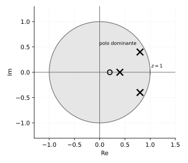

# Respuesta transitoria de sistemas discretos

*Transcripción de las páginas 31, 32, 35 y 36 del cuaderno.*

## Polo dominante

**Polo dominante:** el polo más cercano a $z = 1$.

$$
z_i = e^{T s_i}
\qquad (T: \text{periodo de muestreo})
$$

$$
s_i = \frac{1}{T}\ln z_i
\;\longrightarrow\;
\text{identifica el polo dominante}
$$

### Propiedad del logaritmo complejo

$$
z_i = x + jy = r\,e^{j\theta}
\qquad
r = \sqrt{x^2 + y^2}
\qquad
\theta = \tan^{-1}\!\left(\frac{y}{x}\right)
$$

$$
\ln(x + yj) = \ln\!\left(r e^{j\theta}\right) = \ln r + \ln e^{j\theta}
\qquad\Longrightarrow\qquad
\boxed{\;\ln r + j\theta\;}
$$

---

## Ejercicio

$$
G(z) = \frac{z - 0.2}{(z - 0.4)\,(z^2 - 1.6z + 0.8)}
\qquad
T = 0.2\;\text{s}
$$

$$
z_1 = 0.4
\qquad
z_{2,3} = 0.8 \pm 0.4j
$$

### Paso al plano $s$

$$
s_i = \frac{1}{T}\ln z_i = \frac{1}{0.2}\ln(0.8 \pm j\,0.4)
$$

$$
s_i = \frac{1}{0.2}(-0.11157) + j\,0.463
\qquad\Longrightarrow\qquad
s_i = -0.55785 \pm j\,2.315
$$

De ahí se toman:

$$
\sigma = 0.5579
\qquad
\omega_d = 2.315
$$

<!-- Nota fig. NOTAS-DESARROLLO.md #28: el cuaderno calcula bien sigma=0.55785
     dos lineas arriba, pero aqui lo reescribe como 0.5602 sin explicacion y
     usa ese valor en todo lo que sigue. Corregido a 0.5579 (el valor propio
     ya calculado), y recalculado lo que dependia de el. -->

### Sobrepaso

$$
M_p = e^{-\frac{\sigma\pi}{\omega_d}} = 0.4691
$$

### Valor en estado estable

Para el $y_{ss}$ se halla $K_{st}$ **en discreto**, porque no se tiene la
$G(s)$:

$$
K_{st} = \lim_{z \to 1} G(z)
= \lim_{z \to 1}\frac{z-0.2}{(z-0.4)(z^2-1.6z+0.8)}
= 6.67
$$

$$
y_{ss} = K_{st}\,x_{ss} = 6.67
$$

### Amplitud pico

$$
y_p = y_{ss}\,(1 + M_p) = 9.80
$$

---

## Tiempos característicos

### Tiempo pico

$$
t_p = \frac{\pi}{\omega_d} = \frac{\pi}{2.315} = 1.357\;\text{s}
$$

$$
\frac{1.357\;\text{s}}{0.2} = 6.78 \approx 7\;\text{muestras}
$$

### Tiempo de establecimiento

$$
t_s = \frac{4}{\sigma} = 7.17\;\text{s} \approx 36\;\text{muestras}
$$

### Tiempo de levantamiento

$$
\beta = \tan^{-1}\!\left(\frac{\omega_d}{\sigma}\right)
= \tan^{-1}\!\left(\frac{2.315}{0.5579}\right) = 1.33
$$

$$
t_r = \frac{\pi - \beta}{\omega_d} = 0.78\;\text{s}
$$

---

## ¿El otro polo afecta?

$$
s_3 = \frac{1}{0.2}\ln(0.4) = -4.58
$$

Criterio: se toma la parte real del polo dominante y se multiplica por 5. Si

$$
\left|\mathrm{Re}(s_{dom})\right| \times 5 \;<\; \left|\mathrm{Re}(\text{otro polo})\right|
$$

el otro polo no impacta. Aquí:

$$
0.5579 \times 5 = 2.789
\qquad\text{frente a}\qquad
s_3 = -4.58
$$

## Frecuencia natural y amortiguamiento

$$
\omega_n = \sqrt{\sigma^2 + \omega_d^2} = 2.381
\qquad
\zeta = \frac{\sigma}{\omega_n} = 0.234
$$

<!-- Nota fig. NOTAS-DESARROLLO.md #26: el cuaderno anota zeta=pi/omega_n=0.735.
     La formula correcta es zeta=sigma/omega_n (el coseno del angulo del polo
     respecto al eje real negativo, no una razon con pi). Corregidos formula
     y valor. -->

---

## Variantes del ejercicio

### Si se cambia el polo real a $0.7$

$$
G(z) = \frac{z - 0.2}{(z - 0.7)\,(z^2 - 1.6z + 0.8)}
$$

$$
s_3 = \frac{1}{0.2}\ln(0.7) = -1.78
\qquad
K_{st} = \frac{0.8}{(0.3)(0.2)} = 13.33
\qquad
\text{sobrepico: } 23.5\%
$$

<!-- Nota fig. NOTAS-DESARROLLO.md #27: el cuaderno anota K_st=15.33; con los
     datos de esta misma variante da 13.33. Corregido. -->

### Si se cambia el cero a $0.7$

$$
G(z) = \frac{z - 0.7}{(z - 0.4)\,(z^2 - 1.6z + 0.8)}
\qquad
K_{st} = 2.5
\qquad
\text{sobrepico: } 80.4\%
$$

> **La inestabilidad la dan los polos; los ceros no influyen.**

### Si el cero pasa a $1.1$

$$
G(z) = \frac{z - 1.1}{(z - 0.4)\,(z^2 - 1.6z + 0.8)}
$$

Se invierte el estado estable.
