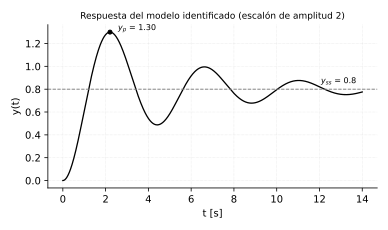

# Simplificación de modelos e identificación

*Transcripción de las páginas 37–41 del cuaderno.*

## Simplificar modelo

Modelo completo:

$$
G(s) = \frac{-(s + 10)}{(s^2 + s + 1)(s + 2)}
$$

El cuaderno dibuja el mapa de polos y ceros: el par complejo en
$-0.5 \pm 0.866j$, el polo real en $-2$ y el cero lejano en $-10$.

### Primera simplificación: quitar el cero lejano

$$
G_1(s) = \frac{K}{(s^2 + s + 1)(s + 2)}
$$

Se conserva la ganancia estática imponiendo

$$
\lim_{s \to 0} G(s) = G_1(s)
\qquad\Longrightarrow\qquad
-5 = \frac{K}{2}
\qquad\Longrightarrow\qquad
K = -10
$$

$$
G_1(s) = \frac{-10}{(s^2 + s + 1)(s + 2)}
$$

### Segunda simplificación: quitar también el polo lejano

$$
G_2(s) = \frac{K}{s^2 + s + 1}
\qquad\text{con}\qquad
K = -5
$$

$$
G_2(s) = \frac{-5}{s^2 + s + 1}
$$

### Rutina MATLAB

**Código en MATLAB (del cuaderno):**

```matlab
clc
clear all
close all

s = tf('s')
gs  = -(s+10) / ((s^2 + s + 1)*(s + 2))
gs1 = -10     / ((s^2 + s + 1)*(s + 2))
gs2 = -5      / (s^2 + s + 1)
step(gs, gs1, gs2)
```

**Equivalente en Python:**

```python
import control as ct
import matplotlib.pyplot as plt

s = ct.tf('s')
gs  = -(s+10) / ((s**2 + s + 1)*(s + 2))
gs1 = -10     / ((s**2 + s + 1)*(s + 2))
gs2 = -5      / (s**2 + s + 1)

for nombre, G in (('completo', gs), ('G1 (sin cero)', gs1), ('G2 (sin polo lejano)', gs2)):
    t, y = ct.step_response(G)
    plt.plot(t, y, label=nombre)
plt.legend()
plt.show()
```

Corrido: las tres respuestas comparten la misma ganancia de DC ($-5$) —
las simplificaciones se hicieron bien, no alteran el valor en estado
estable — y el punto del ejercicio es visual: comparar cuánto se parecen
las curvas *durante el transitorio* a medida que se van quitando el cero
lejano y después el polo lejano.

---

## Identificación

A partir de datos experimentales, encontrar la función de transferencia.
El método: **aplicar un escalón** al proceso y medir la respuesta.

### Modelo subamortiguado

$$
\frac{Y(s)}{X(s)} = \frac{K\,\omega_n^2\,e^{-T_d s}}
{s^2 + 2\zeta\omega_n s + \omega_n^2}
$$

### Modelo sobreamortiguado

$$
\frac{Y(s)}{X(s)} = \frac{K\,e^{-T_d s}}{\tau s + 1}
$$

El cuaderno dibuja la curva típica marcando la zona muerta al inicio, la
subida, la zona de saturación y el estado estable.

---

## Ejemplo de identificación

Datos del ensayo: entrada escalón de amplitud $u = 2$; la salida se estabiliza
en $0.8$, con un pico de $1.3$ alrededor de $t = 2.2$ s.

### Sobrepaso y amortiguamiento

$$
y_p = y_{ss}(1 + M_p)
\qquad\Longrightarrow\qquad
M_p = 0.625
$$

$$
M_p = e^{\left(-\zeta\pi/\sqrt{1-\zeta^2}\right)}
\qquad\Longrightarrow\qquad
0.625 = e^{-\zeta\pi/\sqrt{1-\zeta^2}}
$$

$$
\ln 0.625 = \frac{-\zeta\pi}{\sqrt{1-\zeta^2}}
$$

Despejando:

$$
\sqrt{1-\zeta^2} = \frac{-\zeta\pi}{\ln 0.625}
\qquad\Longrightarrow\qquad
1 - \zeta^2 = \left(\frac{-\zeta\pi}{\ln 0.625}\right)^2
$$

$$
\zeta = \sqrt{\,1 - \left(\frac{-\zeta\pi}{\ln(0.625)}\right)^2\,}
\qquad\Longrightarrow\qquad
\zeta = 0.1479
$$

### Frecuencia natural

$$
t_p = \frac{\pi}{\omega_n\sqrt{1-\zeta^2}}
\qquad\Longrightarrow\qquad
\omega_n = \frac{\pi}{t_p\sqrt{1-\zeta^2}}
$$

$$
\omega_n = \frac{\pi}{2.2\sqrt{1-0.1479}} = 1.443
$$

Como no tiene retardo, $e^{-T_d s}$ desaparece ($T_d = 0$).

### Ganancia

$K$ es la $K_{st}$ del subamortiguado:

$$
K = \frac{y_{ss}}{x_{ss}} = 0.4
$$

### Modelo resultante

$$
G(s) = \frac{Y(s)}{X(s)}
= \frac{K\,\omega_n^2}{s^2 + 2\,(0.1479)(1.44)\,s + 1.44^2}
= \frac{0.4\,(1.44)^2}{s^2 + 2\,(0.1479)(1.44)\,s + 1.44^2}
$$

$$
\boxed{\;
G(s) = \frac{0.829}{s^2 + 0.426\,s + 2.0736}
\;}
$$

<!-- Nota fig. NOTAS-DESARROLLO.md #32: el cuaderno pone 0.56 (= K*wn, no
     K*wn^2) como numerador. Un sistema de 2do orden estandar lleva K*wn^2 en
     el numerador para que la ganancia estatica salga K: G(0)=K*wn^2/wn^2=K.
     Con 0.56 la ganancia estatica da 0.56/2.0736=0.27, no el K=0.4 del
     ensayo -- no reproduce y_ss=0.8 ante el escalon de amplitud 2 (da 0.54).
     Corregido a 0.829=0.4*1.44^2. La figura ya estaba generada con el
     numerador correcto (por eso sí reproducía el ensayo). -->



---

## Segundo ejemplo de identificación

*Páginas 56 y 57 del cuaderno.*

Datos del ensayo:

$$
y_p = 1.5
\qquad
t_p = 2.2
\qquad
y_{ss} = 0.9
\qquad
K_{st} = 0.9
$$

### Sobrepaso y frecuencia amortiguada

$$
1.5 = 0.9\,(1 + M_p)
\qquad\Longrightarrow\qquad
M_p = 0.666
$$

$$
\omega_d = \frac{\pi}{t_p} = \frac{\pi}{2.2} = 1.428
$$

### Vía $\sigma$

$$
0.666 = e^{-\frac{\sigma\pi}{1.428}}
\qquad
\ln 0.666 = \frac{-\sigma\pi}{1.428}
\qquad\Longrightarrow\qquad
\sigma = 0.1847
$$

$$
t_s = \frac{4}{0.1847} = 21.65
$$

$$
\beta = \tan^{-1}\!\left(\frac{1.428}{0.1847}\right) = 1.4421
\qquad
t_r = \frac{\pi - 1.4421}{1.428} = 1.19
$$

### Vía $\zeta$

$$
M_p = e^{-\zeta\pi/\sqrt{1-\zeta^2}}
\qquad\text{equivalente a}\qquad
M_p = e^{-\sigma\pi/\omega_d}
$$

$$
\ln 0.666 = \frac{-\zeta\pi}{\sqrt{1-\zeta^2}}
\qquad\Longrightarrow\qquad
-0.1293 = \frac{-\zeta}{\sqrt{1-\zeta^2}}
$$

$$
0.0167 = \frac{\zeta^2}{1-\zeta^2}
\qquad
0.0167\,(1-\zeta^2) = \zeta^2
\qquad
0.0167 - 0.0167\,\zeta^2 = \zeta^2
$$

$$
1.0167\,\zeta^2 = 0.0167
\qquad
\zeta^2 = 0.0164
\qquad\Longrightarrow\qquad
\zeta = 0.128
$$

$$
\omega_n = \sqrt{1.428^2 + 0.1847^2} = 1.4398
$$

### Modelo resultante

$$
\boxed{\;
G(s) = \frac{1.865}{s^2 + 0.3685\,s + 2.073}
\;}
$$

<!-- Nota fig. NOTAS-DESARROLLO.md #45: mismo error que el primer ejemplo
     pero al reves: el cuaderno deja solo omega_n^2=2.07 como numerador,
     olvidando el factor K=0.9. Con K*wn^2=0.9*1.4398^2=1.865 la ganancia
     estatica sale G(0)=1.865/2.073=0.9=K_st, coherente con el ensayo. -->
