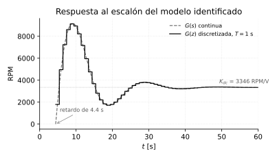
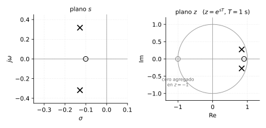

# Práctica del motor

*Transcripción de las páginas 33 y 34 del cuaderno.*

## Objetivo

Modelar el motor: la entrada es **tensión** y la salida **velocidad**.

- Motor → identificación con el toolbox `ident`.
- Medida de velocidad con encoder.

## Caso último del ejercicio anterior

El cálculo manual que se retoma en la práctica:

$$
G(z) = \frac{z - 1.1}{(z - 0.4)\,(z^2 - 1.6z + 0.8)}
$$

*(el valor de $T$ quedó sin anotar en el cuaderno)*

## Divisor de tensión para el acople de señal

Para bajar los 9 V a los 5 V del nivel lógico:


$$
5 = 9 \cdot \frac{R_2}{R_1 + R_2}
\qquad\Longrightarrow\qquad
\frac{5}{9} = \frac{R_2}{R_1 + R_2}
$$

$$
R_2 = 5
\qquad
R_1 + R_2 = 9
\qquad
R_1 = 4
$$

Escalados anotados al margen:

| Relación | ×2 | | |
|---|---|---|---|
| $R_1 = 4$ | 800 | 1.2 | 20 k |
| $R_2 = 5$ | 1000 | 1.5 | 25 k |

*(la cabecera de las dos últimas columnas no quedó anotada)*

## La práctica completa: identificación y discretización del motor

*Esta sección reconstruye, con Python, el informe de laboratorio
"Identificación y discretización de modelo de un motor DC" (E. Amado
Suárez, W. Serrano, M. Gómez — UTS Bucaramanga, octubre de 2018), que es
la versión desarrollada de la práctica anotada arriba. El trabajo original
se hizo en MATLAB con el toolbox Ident; acá se rehace todo con la librería
`control`, se verifica cada número y se señalan tres cosas que en el
informe quedaron mal.*

### El montaje

| Elemento | Qué se usó | Por qué |
|---|---|---|
| Adquisición | Arduino Uno R3 | tiene el ADC y el temporizador necesarios |
| Sensor de velocidad | óptico (ranuras) | cuenta pulsos, no necesita ADC |
| Fuente variable | regulador LM317 | permite barrer el voltaje del motor a mano |
| Acople de la medida | **divisor de tensión** | el ADC del Arduino llega solo a 5 V, y el motor trabaja hasta 9 V |
| Muestreo | $T = 1$ s | — |

El divisor es exactamente el de la sección anterior: $R_1=4$, $R_2=5$ para
llevar 9 V a 5 V. Acá se ve para qué servía.

### Los datos capturados — y por qué la excitación no fue la mejor

Se registraron unos 240 s de voltaje y RPM mientras se giraba el
potenciómetro del LM317 a mano: una rampa lenta de subida hasta unos 8.8 V,
una bajada, y el ciclo repetido una segunda vez. La mitad de los datos se
usó para calcular el modelo y la otra mitad para validarlo (práctica
correcta, y vale la pena subrayarla: **validar con datos que el ajuste no
vio** es lo que distingue una identificación honesta de un
sobreajuste).

**Lo que hoy se haría distinto**: una rampa lenta hecha a mano excita casi
puro contenido de baja frecuencia. El modelo queda bien determinado en DC
y mal en la dinámica rápida — y de ahí sale, en buena medida, que el mejor
ajuste haya sido del **58 %**. Para identificar dinámica hace falta
excitar en el rango de frecuencias donde la planta *se mueve*: escalones
repetidos, una secuencia PRBS (pseudoaleatoria binaria), o un barrido de
frecuencia. Es la misma idea del ensayo de escalón del capítulo 7, pero
llevada en serio.

### El modelo identificado

De los tres candidatos que probó el toolbox, el mejor fue uno de dos polos
y un cero con retardo:

$$
G(s) = e^{-4.4s}\,\frac{3898\,(s+0.1006)}{s^{2}+0.2564\,s+0.1172}
\qquad \text{ajuste } 58\%
$$

Los otros dos quedaron muy por debajo: un polo con retardo dio 44.46 %, y
uno con integrador y retardo apenas 8.48 % — lo que ya dice que el sistema
**no** se comporta como un integrador puro.

```python
import numpy as np, control as ct

G = ct.tf([3898, 3898*0.1006], [1, 0.2564, 0.1172])
print(ct.dcgain(G))          # 3345.89  RPM/V
p = np.roots([1, 0.2564, 0.1172])
wn, zeta = abs(p[0]), -p[0].real/abs(p[0])
print(wn, zeta)              # 0.3423 rad/s,  zeta = 0.3745
```

La ganancia de DC sale **3345.89 RPM/V**, que es el valor $k$ que el
informe usa después para ajustar la discretización. Verificado.

### El detalle más interesante: lo que hace el cero

Con $\zeta = 0.3745$, la fórmula del capítulo 6 predice un sobrepaso de

$$
M_p = e^{-\pi\zeta/\sqrt{1-\zeta^2}} = 28\%
$$

Pero la respuesta real del modelo tiene un sobrepaso del **174 %** — llega
a 9166 RPM para estabilizarse en 3346.



La diferencia es **el cero**. Está en $s=-0.1006$, y la frecuencia natural
del par de polos es $\omega_n = 0.342$: el cero está a $0.29\,\omega_n$,
o sea *más cerca del origen que los polos*. Un cero así de cercano
amplifica enormemente el transitorio.

```python
G_con = ct.tf([3898, 3898*0.1006], [1, 0.2564, 0.1172])
G_sin = ct.tf([3898*0.1006],       [1, 0.2564, 0.1172])   # misma ganancia DC
# pico: 9166 RPM (174 %)  vs  4287 RPM (28 %)
```

**La lección**: la fórmula $M_p(\zeta)$ del capítulo 6 vale para un
segundo orden **sin ceros**. Un cero cerca del origen la invalida por
completo — un factor de 6 en este caso. Hay que mirarlo antes de creerle
al número.

*(Y si el modelo es fiel, dice algo físico: un motor DC solo no tiene
ceros ni sobrepasa así. Un cero tan dominante sugiere que lo identificado
incluye la dinámica del sensor y del acondicionamiento, no solo el motor.)*

### Discretización por correspondencia de polos y ceros

El informe **no** usó `c2d` para el cálculo principal: hizo la
discretización a mano por el método de correspondencia de polos y ceros,
que es el que corresponde a los capítulos 4 y 11. La regla es la del
mapeo $z=e^{sT}$ aplicada a cada raíz:

$$
G(z) = \alpha K\,
\frac{(z+1)^{\,n-m}\prod_j (z - e^{b_jT})}{\prod_i (z - e^{a_iT})}
$$

donde $a_i$ son los polos, $b_j$ los ceros, y el factor $(z+1)^{n-m}$
reemplaza a los $n-m$ ceros que $G(s)$ tiene "en el infinito" ($z=-1$ es
la imagen de $s=-\infty$, el punto de la frecuencia de Nyquist).

**Paso a paso, con $T=1$ s:**

```python
T = 1.0
p  = np.roots([1, 0.2564, 0.1172])       # polos de G(s)
zp = np.exp(p*T)                          # 0.83573 +- 0.27457j
zz = np.exp(-0.1006*T)                    # 0.90429   <- el cero

den = [1, -2*zp[0].real, abs(zp[0])**2]   # z^2 - 1.671456 z + 0.773832
num = np.polymul([1, 1], [1, -zz])        # (z+1)(z - 0.9043)

# alpha*K se fija igualando la ganancia de DC: G(z=1) = G(s=0)
kd = ct.dcgain(G) / (np.polyval(num, 1)/np.polyval(den, 1))
print(kd)                                 # 1789.56
```

El par complejo se junta en un polinomio real con la identidad de siempre:
$(z-z_p)(z-\bar{z_p}) = z^2 - 2\,\mathrm{Re}\{z_p\}\,z + |z_p|^2$.

$$
\boxed{\;
G(z) = z^{-4}\,\frac{1789.56\,(z+1)(z-0.9043)}
{z^{2}-1.671456\,z+0.773832}
\;}
$$



**El retardo**: $e^{-4.4s}$ con $T=1$ s son 4.4 muestras, y $z^{-4.4}$ no
existe — el informe redondea a $z^{-4}$. Es correcto hacerlo, pero queda
**0.4 s de retardo sin modelar**, casi medio periodo de muestreo. Con un
$T$ más chico el redondeo dolería menos; es otro argumento a favor de
muestrear más rápido que 1 s.

### Comparación con la función automática

```python
Gd = ct.sample_system(G, T, method='matched')
#  (3579 z - 3237) / (z^2 - 1.671 z + 0.7738),   dcgain = 3345.89
```

Los polos y el cero salen **idénticos** a los calculados a mano. La
diferencia está en el numerador: `python-control` **no** agrega el factor
$(z+1)$, mientras que el `c2d(...,'matched')` de MATLAB sí (en el informe
dio $1768.5(z+1)(z-0.9042)$). Son dos variantes legítimas del mismo
método:

| Variante | Ceros agregados | Efecto |
|---|---|---|
| MATLAB `c2d` matched | $(z+1)^{n-m}$ | grado relativo 0: la salida responde **en la misma muestra** |
| `python-control` matched | $(z+1)^{n-m-1}$ | grado relativo 1: deja **un periodo de retardo**, más realista para un lazo con computador |

Las dos tienen la misma ganancia de DC (3345.89) y respuestas al escalón
que difieren menos del 1 % en el pico (9124 contra 9186). No hay una
"correcta": hay que saber cuál usa la herramienta, porque cambia si el
modelo tiene o no transmisión directa.

### Tres correcciones al informe original

1. **La ganancia $k_d$ está mal.** El informe da $k_d = 1797.06$; el valor
   que iguala la ganancia de DC es **1789.56**. Se verificó de dos formas
   —con los polos exactos y con los valores redondeados que el propio
   informe imprime— y las dos dan 1789.5. Es un error del 0.42 %: chico,
   pero es el tipo de cosa que se arrastra.
2. **El pie de la figura dice "Respuesta al impulso"** y la gráfica es
   claramente una **respuesta al escalón** (el propio título de MATLAB
   dice *Step Response*, y la curva se estabiliza en la ganancia de DC, no
   en cero).
3. **Las RPM no cierran.** Los datos llegan a 70 000 RPM y la ganancia de
   DC implica unas 29 000 RPM a 8.8 V. Ningún motor DC de laboratorio gira a
   esa velocidad. Lo más probable es que el disco del sensor óptico tenga
   varias ranuras por vuelta y no se haya dividido por ese número — un
   error de **escala**, no de dinámica, que no afecta polos ni ceros pero
   sí invalida todas las unidades. Es la clase de detalle que hay que
   revisar antes de dar por buena una identificación.

## Ejercicios propuestos

**8.1** Con el modelo identificado, calcular la velocidad en estado
estable para 5 V. Comparar contra lo que se ve en la gráfica de datos
capturados a ese voltaje y comentar.

**8.2** Repetir la discretización por correspondencia de polos y ceros con
$T = 0.2$ s. (a) ¿Dónde caen los polos en $z$? (b) ¿Cuántas muestras de
retardo son ahora los 4.4 s, y cuánto queda sin modelar al redondear?
(c) ¿Por qué los polos se acercan a $z=1$ al bajar $T$?

**8.3** Comparar los tres métodos de discretización sobre esta planta:
correspondencia de polos y ceros, ZOH (`method='zoh'`) y bilineal
(`method='bilinear'`), con $T=1$ s. Graficar las tres respuestas al
escalón superpuestas y decir cuál se parece más a la continua.

**8.4** Diseñar el divisor de tensión para medir hasta **12 V** con un ADC
de 3.3 V. (a) Dar una pareja $R_1$, $R_2$ con valores comerciales.
(b) ¿Cuánto vale la resolución de la medida de voltaje con un ADC de
10 bits?

**8.5** *(conceptual)* El ajuste del modelo fue del 58 %. Proponer tres
cambios concretos al experimento que mejorarían ese número, y justificar
cada uno.

### Respuestas

**8.1** $\omega_{ss} = 3345.89\times5 = 16\,729$ RPM. En los datos, a 5 V
se ven del orden de 10 000 RPM — no coincide, y es coherente con el
problema de escala del punto 3 de arriba y con que el sistema **nunca
estuvo en estado estable** durante la captura (el voltaje se movía todo el
tiempo).

**8.2** (a) $z = e^{pT}$ con $T=0.2$: $|z| = e^{-0.1282\times0.2} =
0.9747$ y ángulo $0.3174\times0.2 = 0.0635$ rad $\Rightarrow$
$z = 0.9727 \pm 0.0619j$. (b) $4.4/0.2 = 22$ muestras **exactas** — no
queda nada sin modelar, que es la ventaja del $T$ chico. (c) Porque
$z=e^{sT}$ y cuando $T\to0$, $e^{sT}\to1$: todo el plano $s$ se comprime
alrededor de $z=1$. Es el fenómeno del capítulo 11 — con $T$ muy chico los
polos quedan tan juntos que la aritmética de punto fijo del micro empieza
a sufrir.

**8.3** Los tres dan **exactamente** la misma ganancia de DC (3345.89, por
construcción: los tres métodos la preservan). Correspondencia de polos y
ceros y ZOH dan además **los mismos polos**, $0.8357\pm0.2746j$ —lógico,
porque los dos mapean con $z=e^{sT}$—; la bilineal los corre un poco, a
$0.8386\pm0.2742j$, que es el *warping* de frecuencia del capítulo 11.
Las diferencias reales están en los ceros, y por lo tanto en el
transitorio. ZOH es la referencia física, porque es lo que hace un
retenedor real a la salida del computador.

**8.4** (a) Hace falta $R_2/(R_1+R_2) = 3.3/12 = 0.275$. Con
$R_1 = 27$ k$\Omega$ y $R_2 = 10$ k$\Omega$: $10/37 = 0.270$ $\to$ 3.24 V
a fondo de escala. Sirve, y deja un pequeño margen de seguridad.
(b) $\Delta = 3.3/1024 = 3.22$ mV en el ADC, que referidos a la entrada
son $3.22/0.270 = 11.9$ mV de resolución sobre los 12 V.

**8.5** Tres cambios, en orden de impacto: **(i)** excitar con escalones o
una señal PRBS en vez de una rampa manual, para meter contenido de alta
frecuencia donde vive la dinámica; **(ii)** bajar el periodo de muestreo
de 1 s a algo del orden de 100 ms: la constante de tiempo dominante es
$1/0.1282 = 7.8$ s, así que $T=1$ s es apenas $\tau/7.8$ —por debajo de la
regla de $\tau/10$ del capítulo 15— y además hace que el retardo de 4.4 s
no caiga en un número entero de muestras; **(iii)** arreglar la escala de RPM (dividir por el
número de ranuras del disco) y verificar el divisor de tensión con un
multímetro, para que las unidades y la ganancia sean creíbles.
