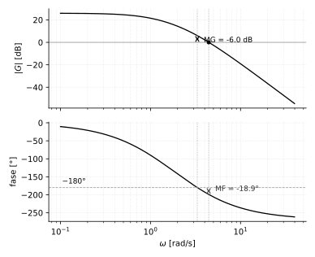

# Error en estado estable y criterios de estabilidad

*Transcripción de las páginas 42–47 del cuaderno.*

## Control proporcional

Forma general de la planta, con $r$ integradores explícitos:

$$
G(s) = \frac{b_0 s^{m} + b_1 s^{m-1} + \cdots + b_m}
{s^{\,r}\left(a_0 s^{n} + a_1 s^{n-1} + \cdots + a_n\right)}
$$

De acuerdo al error, la acción proporcional actúa.

### Entrada escalón

$$
R(s) = \frac{1}{s}
$$

$$
\frac{E(s)}{R(s)} = \frac{1}{1 + K\,G(s)} = T(s)
\qquad
K_p = K\,G(s)
$$

$$
\begin{aligned}
E_{ss} &= \lim_{s \to 0} s\,E(s) = \lim_{s \to 0} s\,T(s)\,R(s) \\[4pt]
E_{ss} &= \lim_{s \to 0} s\,\frac{1}{s}\,\frac{1}{1 + K\,G(s)} \\[4pt]
E_{ss} &= \lim_{s \to 0} \frac{1}{1 + K_p}
\end{aligned}
$$

Despejando la ganancia:

$$
(1 + K_p)\,E_{ss} = 1
\qquad
1 + K_p = \frac{1}{E_{ss}}
\qquad
\boxed{\;K_p = \frac{1}{E_{ss}} - 1\;}
$$

$K_p$ es la **ganancia de error de posición**:

$$
K_p = \lim_{s \to 0} K\,G(s)
$$

| $r$ | $K_p$ | $E_{ss}$ |
|---|---|---|
| 0 | $\dfrac{K\,b_m}{a_n}$ | $\dfrac{1}{1+K_p}$ |
| $r \geq 1$ | $\infty$ | 0 |

El cuaderno dibuja las dos respuestas: con $r = 0$ la salida se queda a una
distancia $E_{ss}$ de la referencia; con $r \geq 1$ la alcanza.

### Entrada rampa

$$
R(s) = \frac{1}{s^2}
$$

$$
E_{ss} = \lim_{s \to 0} s\,T(s)\,R(s)
= \lim_{s \to 0} s\,\frac{1}{s^2}\,\frac{1}{1 + K\,G(s)}
$$

$K_v$ es la **constante de error de velocidad**:

$$
K_v = \lim_{s \to 0} s\,K\,G(s)
$$

| $r$ | $K_v$ | $E_{ss}$ |
|---|---|---|
| 0 | 0 | $\infty$ |
| 1 | $\dfrac{K\,b_m}{a_n}$ | $\dfrac{1}{K_v}$ |
| $r \geq 2$ | $\infty$ | 0 |

---

## Caso discreto

### Entrada escalón

$$
E_{ss} = \frac{1}{1 + K_p}
\qquad\Longrightarrow\qquad
K_p = \lim_{s \to 0} K\,G(s) = \lim_{z \to 1} K\,G(z)
$$

### Entrada rampa

$$
E_{ss} = \frac{1}{K_v}
\qquad
K_v = \lim_{s \to 0} s\,K\,G(s)
= \lim_{z \to 1}\left(\frac{z-1}{z}\right)\frac{1}{T}\,K\,G(z)
$$

---

## Margen de ganancia

La ganancia máxima a la que el sistema puede trabajar.

$$
MG = -6\;\text{dB}
$$

Es el punto o valor en frecuencia donde la fase vale $180°$.

*(la misma figura marca también el margen de fase — ver más abajo,
sección "Margen de fase")*

Ganancia crítica:

$$
\boxed{\;K_{max} = 10^{\,MG/20}\;}
$$

### Ejemplo

$$
E_{ss} = 0.05 \;\longrightarrow\; 5\%
$$

$$
K_p = \frac{1}{0.05} - 1 = 19
$$

$$
K = \frac{K_p}{\lim\limits_{s \to 0} G(s)}
= \frac{K_p}{\lim\limits_{z \to 1} G(z)}
$$

Con la planta

$$
G(z) = \frac{z^2 + z + 0.5}{z^3 + 32z^2 + 4z + 0.2}
$$

$$
\lim_{z \to 1} G(z) = \frac{2.5}{37.2} = 0.0672
$$

$$
K = \frac{19}{0.0672} = 282.73
$$

---

## Margen de fase

*Vacío señalado en NOTAS-DESARROLLO.md #47: se completa acá porque el
margen de fase es la pareja natural del margen de ganancia y suele pesar
más en el diseño — dos sistemas con el mismo MG pueden comportarse muy
distinto según su MF.*

Mientras el margen de ganancia mide **cuánto se puede subir la ganancia**
antes de la inestabilidad (medido donde la fase ya vale $-180°$), el margen
de fase mide **cuánta fase se puede perder** antes de la inestabilidad —
medido en el punto donde la *magnitud* ya vale $0\,\text{dB}$ (la
**frecuencia de cruce de ganancia**, $\omega_{gc}$):

$$
\boxed{\;
MF = 180° + \angle G(j\omega_{gc})
\qquad\text{con } \omega_{gc} \text{ tal que } |G(j\omega_{gc})| = 1 \;(0\,\text{dB})
\;}
$$

Si $MF>0$, la fase real todavía no llegó a $-180°$ en el punto donde la
ganancia ya cruzó $0\,\text{dB}$ — hay margen antes de la inestabilidad. Si
$MF<0$, la fase ya pasó $-180°$ *antes* de que la ganancia bajara de
$0\,\text{dB}$: el sistema es inestable a lazo cerrado, igual conclusión
que daría un $MG<0$.

Sobre el mismo sistema ilustrativo de la figura de arriba
($G(s) = K/[(s+1)(s+2)(s+3)]$, con el $K$ que da $MG=-6\,\text{dB}$):

$$
\omega_{gc} = 4.43\;\text{rad/s}
\qquad\Longrightarrow\qquad
\angle G(j\omega_{gc}) = -198.9°
\qquad\Longrightarrow\qquad
MF = -18.9°
$$

Los dos márgenes salen negativos — **coinciden**, como debe ser: para un
sistema de fase mínima como este, $MG$ y $MF$ tienen que concordar en si el
lazo cerrado es estable o no. Que ambos den negativo con el mismo $K$
confirma la inestabilidad, no es una casualidad.

**Valores sanos, como referencia de diseño** (no hay una regla única, pero
son los rangos típicos que se enseñan): $MF$ entre $30°$ y $60°$ (con
$45°$ como objetivo frecuente), y $MG$ de varios dB por encima de $0$
(un mínimo común es $6\,\text{dB}$). Un $MF$ muy chico (aunque positivo)
da un sistema técnicamente estable pero con mucho sobrepaso y poco
amortiguamiento — hay una relación aproximada útil para diseño rápido:

$$
\zeta \approx \frac{MF\,[°]}{100}
\qquad\text{(válida aprox. para } MF \lesssim 60°\text{)}
$$

## Control integral

$$
E_{ss} = \frac{1}{K_v} = 0.5
$$

$$
K_v = \lim_{s \to 0} K\,s\,G(s)
= \lim_{z \to 1}\left(\frac{z-1}{z}\right)\frac{1}{T}\,K\,\frac{z}{z-1}\,G(z)
$$

---

## Criterio de Routh

Permite determinar la cantidad de polos en lazo cerrado que se encuentran en
el semiplano derecho del plano $s$, **sin factorizar el polinomio**.

Procedimiento:

1. Se escribe el polinomio característico (el denominador).
2. Ver que todos los coeficientes sean positivos y que todos los coeficientes
   estén presentes.
3. Se acomodan los coeficientes en filas y columnas.

$$
\frac{C(s)}{R(s)} =
\frac{b_0 s^{m} + b_1 s^{m-1} + \cdots + b_{m-1}s + b_m}
{a_0 s^{n} + a_1 s^{n-1} + \cdots + a_{n-1}s + a_n}
$$

La tabla:

| | | | | |
|---|---|---|---|---|
| $s^{n}$ | $a_0$ | $a_2$ | $a_4$ | $a_6 \;\cdots$ |
| $s^{n-1}$ | $a_1$ | $a_3$ | $a_5$ | $a_7 \;\cdots$ |
| $s^{n-2}$ | $b_1$ | $b_2$ | $b_3$ | $b_4$ |
| $s^{n-3}$ | $c_1$ | $c_2$ | $c_3$ | $c_4$ |
| $\vdots$ | | | | |

El número total de filas es $n + 1$.

---

## Criterio de Jury

*Vacío señalado en NOTAS-DESARROLLO.md #46 y #48: el cuaderno usa Routh
(que es del plano $s$) sobre sistemas discretos sin decir por qué aplica.
Jury es el equivalente directo de Routh, pero trabajado en el plano $z$ —
no hace falta pasar por $s$ para nada.*

### Por qué Routh solo no alcanza acá

Routh determina estabilidad viendo si hay raíces en el semiplano derecho de
$s$. Para un polinomio en $z$, la condición de estabilidad es otra: **todas
las raíces dentro del círculo unitario**, $|z_i|<1$. Son criterios sobre
regiones geométricamente distintas — Routh tal cual no sirve sobre un
polinomio en $z$.

Hay dos caminos igual de válidos para sistemas discretos:

1. **Bilineal + Routh**: aplicar la transformación bilineal del capítulo 4
   ($z = \frac{1+wT/2}{1-wT/2}$, con $w$ como la nueva variable) al polinomio
   característico en $z$, lo que lo convierte en un polinomio en $w$ donde
   *sí* aplica Routh tal cual (el círculo unitario en $z$ mapea al semiplano
   izquierdo en $w$, por la misma propiedad de la bilineal vista en el
   capítulo 4).
2. **Criterio de Jury**: un procedimiento tabular, análogo en espíritu a
   Routh, pero que trabaja **directo sobre los coeficientes del polinomio
   en $z$**, sin transformar nada.

### La tabla de Jury

Para $P(z) = a_n z^n + a_{n-1}z^{n-1} + \cdots + a_1 z + a_0$ con $a_n>0$:

| Fila | | | | |
|---|---|---|---|---|
| $z^0 \cdots z^n$ | $a_0$ | $a_1$ | $\cdots$ | $a_n$ |
| (invertida) | $a_n$ | $a_{n-1}$ | $\cdots$ | $a_0$ |
| $b$ | $b_0$ | $b_1$ | $\cdots$ | $b_{n-1}$ |
| (invertida) | $b_{n-1}$ | $\cdots$ | $b_1$ | $b_0$ |
| $\vdots$ | | | | |

con $b_k = a_0 a_k - a_n a_{n-k}$ (determinante $2\times2$ de las esquinas
de las dos filas de arriba), y así sucesivamente reduciendo una fila por
par hasta llegar a una fila de 3 términos. Son $2n-3$ filas en total.

**Condiciones necesarias y suficientes** (todas deben cumplirse):

$$
|a_0| < a_n
\qquad
P(1) > 0
\qquad
(-1)^n\,P(-1) > 0
\qquad
\text{y } n-2 \text{ condiciones más, una por cada par de filas de la tabla}
$$

### Caso particular $n=2$ — el que más se usa a mano

Para $P(z) = a_2 z^2 + a_1 z + a_0$ (con $a_2>0$), las tres primeras
condiciones ya son necesarias **y suficientes** — no hace falta construir
tabla:

$$
\boxed{\;|a_0| < a_2 \qquad P(1) = a_2+a_1+a_0 > 0 \qquad P(-1) = a_2-a_1+a_0 > 0\;}
$$

**Ejemplo** — reutilizando el denominador $z^2-1.6z+0.8$ que ya apareció
varias veces en capítulos anteriores (los polos $0.8\pm0.4j$ del capítulo
de respuesta transitoria):

$$
a_2 = 1 \qquad a_1 = -1.6 \qquad a_0 = 0.8
$$

$$
|0.8| < 1 \;\checkmark
\qquad
P(1) = 1 - 1.6 + 0.8 = 0.2 > 0 \;\checkmark
\qquad
P(-1) = 1 + 1.6 + 0.8 = 3.4 > 0 \;\checkmark
$$

Las tres se cumplen $\Rightarrow$ estable. Coincide con lo que ya se sabía
por otra vía: $|0.8\pm0.4j| = \sqrt{0.8^2+0.4^2} = 0.894 < 1$, dentro del
círculo unitario.
