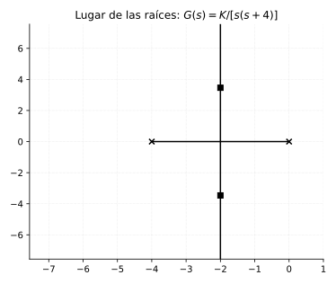
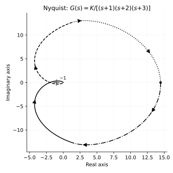
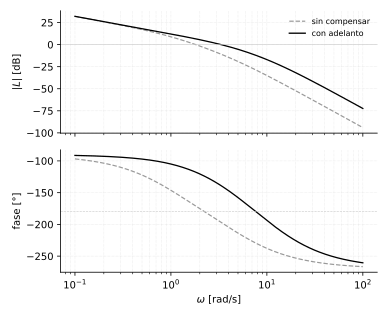

# Técnicas clásicas de diseño (complemento)

*Capítulo agregado a partir de una evaluación del curso — no sale del
cuaderno ni corresponde a ninguna página. El patrón que se repite en todo
lo transcrito es que el curso **calcula** bien (dado un sistema, encontrar
el margen, la estabilidad, el error) pero **diseña** poco (dado un
objetivo, encontrar el controlador que lo cumple). Este capítulo cubre las
tres piezas clásicas de diseño que faltaban: lugar de las raíces, Nyquist
como criterio (no solo Bode) y compensadores de adelanto/atraso.*

*Ejemplos en **Python** con la librería
[`control`](https://python-control.readthedocs.io/) (`pip install
control`), el equivalente directo del Control System Toolbox de MATLAB
— `tf`, `feedback`, `pole`, `step_response` funcionan prácticamente igual.*

## Lugar de las raíces (*root locus*)

Muestra cómo se mueven los polos de lazo cerrado cuando una ganancia $K$
varía de $0$ a $\infty$, para un lazo con función de transferencia de lazo
abierto $KG(s)H(s)$. Es la herramienta central de diseño clásico (Ogata y
Kuo, la bibliografía del curso, le dedican capítulos enteros) y en el
curso solo aparece nombrada como comando de MATLAB.

**Ecuación que define el lugar:** los polos de lazo cerrado son las raíces
de

$$
1 + K\,G(s)H(s) = 0
$$

**Reglas básicas para leerlo** (sin demostrarlas, son constructivas):

- El lugar tiene tantas ramas como polos de $G(s)H(s)$.
- Cada rama **arranca** ($K=0$) en un polo de lazo abierto y **termina**
  ($K\to\infty$) en un cero de lazo abierto (o se va al infinito si no hay
  suficientes ceros finitos).
- Un punto del eje real pertenece al lugar si a su derecha hay un número
  **impar** de polos y ceros reales de lazo abierto.
- Las ramas que se van al infinito lo hacen a lo largo de asíntotas,
  centradas en $\sigma_a = \frac{\sum \text{polos} - \sum \text{ceros}}{n-m}$.

### Ejercicio de diseño — elegir $K$ para un amortiguamiento objetivo

$$
G(s) = \frac{1}{s(s+4)}
\qquad\text{(lazo unitario, sin compensador)}
$$

Objetivo: elegir $K$ tal que el lazo cerrado tenga $\zeta=0.5$ (típico,
un 16 % de sobrepaso).

Lazo cerrado: $T(s) = \dfrac{K}{s^2+4s+K}$. Comparando con la forma
estándar $s^2+2\zeta\omega_n s + \omega_n^2$:

$$
2\zeta\omega_n = 4
\qquad
\omega_n^2 = K
$$

Con $\zeta=0.5$: $\omega_n = 4/(2\times0.5) = 4 \;\Rightarrow\; K=\omega_n^2=16$.

```python
import control as ct

G = ct.tf([1], [1, 4, 0])       # 1/(s(s+4))
K = 16
T = ct.feedback(K*G, 1)

print(ct.poles(T))               # [-2+3.464j  -2-3.464j]
wn, zeta, _ = ct.damp(T)
print(zeta)                      # [0.5  0.5]  -> objetivo cumplido
```



Los polos de lazo cerrado con $K=16$ quedan en $-2\pm j3.464$ — se
verifica $\zeta=\sigma/\omega_n=2/4=0.5$, igual que con la fórmula
analítica.

## Criterio de Nyquist

El margen de ganancia y el margen de fase (ya vistos) salen de leer el
Bode en dos puntos concretos — son un atajo práctico, pero **asumen que el
sistema es de fase mínima** (sin polos ni ceros en el semiplano derecho).
El criterio de Nyquist es la herramienta general de la que esos márgenes
son un caso particular, y no depende de esa suposición.

**Enunciado (forma práctica):**

$$
Z = N + P
$$

- $P$ = polos de $G(s)H(s)$ en el semiplano derecho (lazo **abierto**).
- $N$ = número de vueltas que da la curva de Nyquist (la imagen de
  $G(j\omega)H(j\omega)$ recorriendo todo el eje imaginario) alrededor del
  punto $-1$, **en sentido horario**.
- $Z$ = polos de lazo **cerrado** en el semiplano derecho.

El sistema es estable a lazo cerrado si y solo si $Z=0$.

### Verificación — el mismo sistema inestable de margen de ganancia/fase

Reutilizando $G(s)=K/[(s+1)(s+2)(s+3)]$ con el $K=119.08$ que ya se sabía
inestable (daba $MG=-6\,\text{dB}$ y $MF=-18.9°$, ambos negativos):

```python
import control as ct
import numpy as np

K = 119.08
G = ct.tf([K], np.polynomial.polynomial.polyfromroots([-1, -2, -3])[::-1])

# P: polos de G en el semiplano derecho -- ninguno, G ya es estable a lazo abierto
P = 0

count = ct.nyquist_response(G).count   # vueltas alrededor de -1
Z = count + P
print('N =', count, ' Z =', Z)
```



La curva rodea el punto $-1$ (se ve claro en la figura, el lazo pequeño
alrededor de $-1$) — confirma $Z>0$, hay polos de lazo cerrado inestables,
**tercera confirmación independiente** de lo que ya habían dicho $MG$ y
$MF$. La ventaja real de Nyquist aparece cuando $P\neq 0$ (planta
inestable a lazo abierto): ahí margen de ganancia/fase solos pueden dar
una lectura engañosa, y hay que contar vueltas.

## Compensadores de adelanto y atraso (*lead-lag*)

PID es un caso particular de compensación — funciona muy bien en la
práctica, pero el diseño clásico por Bode/lugar de las raíces usa
compensadores más simples y con una lógica de diseño más directa cuando
el objetivo es una especificación puntual (margen de fase, ancho de
banda).

$$
G_c(s) = K_c\,\frac{s+z}{s+p}
$$

- **Adelanto** ($z<p$): agrega **fase positiva** cerca de la frecuencia
  $\omega_m=\sqrt{zp}$ — mejora margen de fase y velocidad de respuesta.
  Es el más parecido en efecto a la parte derivativa de un PID.
- **Atraso** ($z>p$): no agrega fase útil, pero aumenta la ganancia a
  **baja frecuencia** sin tocar mucho la zona de cruce — reduce error en
  estado estable sin arriesgar estabilidad. Parecido en efecto a la parte
  integral.

### Diseño de un compensador de adelanto — paso a paso

$$
G(s) = \frac{20}{s(s+1)(s+5)}
$$

```python
import control as ct
gm, pm, wg, wp = ct.margin(ct.tf([20],[1,6,5,0]))
print(pm)   # 8.9 grados -- muy poco margen, se satura ante cualquier perturbacion
```

**1. Fase de adelanto necesaria** $\phi_{max}$ — se pide más de lo que
falta, porque agregar el compensador desplaza la frecuencia de cruce (acá
se apunta a $\phi_{max}=58°$ para terminar con margen real razonable):

$$
\alpha = \frac{1-\operatorname{sen}\phi_{max}}{1+\operatorname{sen}\phi_{max}}
$$

**2. Frecuencia $\omega_m$** donde se coloca el pico de fase: se busca en
el Bode de $G$ sin compensar el punto donde $|G(j\omega)|_{dB} = 10\log_{10}\alpha$
(la ganancia que el compensador va a *restar* en ese punto).

**3. Polo y cero del compensador:**

$$
T = \frac{1}{\omega_m\sqrt{\alpha}}
\qquad
z = \frac{1}{T}
\qquad
p = \frac{1}{\alpha T}
\qquad
K_c = \frac{1}{\alpha}\;\text{(para no perder ganancia de DC)}
$$

```python
import numpy as np

phi_max = np.radians(58)
alpha = (1-np.sin(phi_max))/(1+np.sin(phi_max))     # 0.132

w = np.logspace(-1, 2, 5000)
mag, fase, _ = ct.frequency_response(G, w)
idx = np.argmin(np.abs(20*np.log10(mag) - (-10*np.log10(alpha))))
wm = w[idx]                                          # 3.33 rad/s

T = 1/(wm*np.sqrt(alpha))
zero, pole, Kc = 1/T, 1/(alpha*T), 1/alpha
# zero=0.956  pole=11.631  Kc=12.162

C = Kc * ct.tf([1, zero], [1, pole])
gm2, pm2, wg2, wp2 = ct.margin(C*G)
print(pm2)   # 41.0 grados
```



De $MF=8.9°$ (casi inestable ante cualquier perturbación) a $MF=41°$ —
gran mejora, aunque no llegó exacto a los $58°$ pedidos: es normal, el
diseño de adelanto de una sola etapa tiene un límite práctico (si hace
falta más fase de la que un solo polo-cero puede dar sin quedar muy
separados, se usan **dos etapas de adelanto en cascada** en vez de forzar
un $\alpha$ muy chico).
