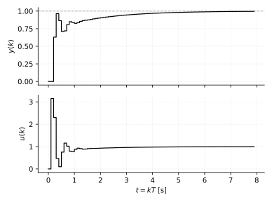
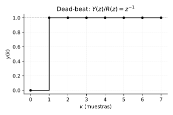
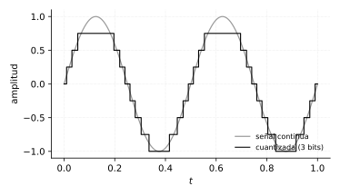

# Complementos de control digital (implementación práctica)

*Capítulo agregado a partir de una evaluación del curso — no sale del
cuaderno. Cubre tres cosas específicamente **digitales** (sin equivalente
en control análogo) que quedaban sin tratar: la ecuación en diferencias
del PID (lo que realmente se programa), el control _dead-beat_ (el
ejemplo clásico de "esto solo se puede hacer en digital"), y las dos
limitaciones físicas del muestreo — antialiasing y cuantización.*

## PID discreto: la ecuación que se programa

El capítulo de PID da $G_c(s) = K[1+\frac{1}{T_i s}+T_d s]$ — la forma
continua. Para programarlo en un microcontrolador o PLC hace falta
aproximar la integral y la derivada con las muestras disponibles.

**Aproximaciones** (Euler hacia atrás, la más simple y la más usada en la
práctica por ser siempre estable):

$$
\int e\,dt \;\approx\; T\sum_{j=0}^{k} e(j)
\qquad\qquad
\frac{de}{dt} \;\approx\; \frac{e(k)-e(k-1)}{T}
$$

**Forma posicional** (la salida $u(k)$ se calcula completa cada muestra):

$$
\boxed{\;
u(k) = K_p\,e(k) + K_i\,T\sum_{j=0}^{k} e(j) + K_d\,\frac{e(k)-e(k-1)}{T}
\;}
$$

**Forma incremental** (se calcula solo el cambio $\Delta u$, y se le suma
a la salida anterior — evita tener que guardar toda la suma acumulada, y
de paso hace el *anti-windup* por saturación del capítulo de PID mucho
más simple: si el actuador está saturado, alcanza con no sumar $\Delta u$):

$$
\Delta u(k) = u(k)-u(k-1)
= K_p\big[e(k)-e(k-1)\big]
+ K_i T\,e(k)
+ \frac{K_d}{T}\big[e(k)-2e(k-1)+e(k-2)\big]
$$

### Simulación — el lazo completo, planta incluida

```python
import numpy as np

# Planta discreta de primer orden: y(k) = a*y(k-1) + b*u(k-1)
a, b = 0.8, 0.2
T = 0.1                          # periodo de muestreo
Kp, Ki, Kd = 2.0, 1.5, 0.1
N, r = 80, 1.0

y = np.zeros(N); u = np.zeros(N); e = np.zeros(N)
integral = 0.0
for k in range(1, N):
    e[k] = r - y[k-1]
    integral += e[k]
    deriv = (e[k]-e[k-1]) / T
    u[k] = Kp*e[k] + Ki*T*integral + Kd*deriv    # forma posicional
    y[k] = a*y[k-1] + b*u[k-1]                    # respuesta de la planta
```



Con estas ganancias el error queda por debajo de 0.004 a los 8 s — este
mismo bloque `for` (con los límites de saturación del actuador agregados)
es, literalmente, el código que correría en el microcontrolador.

## Control *dead-beat* — el ejemplo que no tiene análogo continuo

Un controlador digital puede colocar **todos** los polos de lazo cerrado
exactamente en $z=0$ — eso significa que la respuesta al escalón llega
**exacto** a la referencia en un número finito de muestras y se queda ahí,
sin transitorio después. No hay ningún controlador continuo que logre
esto (un sistema continuo siempre se acerca asintóticamente, nunca en
tiempo finito).

### Ejemplo — diseño completo

$$
G(z) = \frac{0.5}{z-0.5}
$$

**Objetivo**: $\dfrac{Y(z)}{R(z)} = z^{-1}$ (llega exacto una muestra
después del escalón, y con ganancia de DC = 1 para error estacionario
cero — las dos condiciones a la vez, no alcanza con poner los polos en
cero nada más).

Despejando $G_c$ de $T = \dfrac{G_c G}{1+G_c G}$:

$$
G_c(z) = \frac{T}{G\,(1-T)}
= \frac{1/z}{\dfrac{0.5}{z-0.5}\left(1-\dfrac1z\right)}
= \frac{2(z-0.5)}{z-1}
$$

El cero de $G_c$ en $z=0.5$ **cancela** el polo de la planta, y el polo en
$z=1$ es un integrador puro (para el error cero en estado estable —
coherente con lo visto en el capítulo de error estacionario: se necesita
un integrador para seguir un escalón sin error).

```python
import control as ct

G  = ct.tf([0.5], [1, -0.5], dt=1)
Gc = ct.tf([2, -1], [1, -1], dt=1)     # 2(z-0.5)/(z-1)

T = ct.feedback(Gc*G, 1)
print(ct.minreal(T, verbose=False))     # 1/z, exacto

t, y = ct.step_response(T, np.arange(8))
print(y[:3])                            # [0.  1.  1.]  -- llega en 1 muestra
```



**Por qué no se usa siempre**: exige un esfuerzo de control muy grande en
las primeras muestras (mirar $u(k)$ de un caso real da picos altos), es
muy sensible a error de modelado (si $G_c$ cancela un polo que en la
planta real no está exactamente ahí, la cancelación queda imperfecta y
aparece una dinámica residual lenta), y no deja margen de diseño para
robustez — por eso en la práctica se prefiere PID bien sintonizado o
variantes menos agresivas (*dead-beat* con polos en un radio pequeño pero
no exactamente cero) antes que el dead-beat puro salvo que el problema
realmente exija settling time mínimo garantizado.

## Las dos limitaciones físicas del muestreo

El criterio de Nyquist (capítulo de modelado) dice a qué frecuencia
muestrear — pero asume una señal ya bien comportada. En la práctica hay
dos problemas previos que Nyquist no resuelve solo.

### Filtro antialiasing

Nyquist exige que la señal esté **limitada en banda** por debajo de
$f_s/2$. Si la señal real tiene ruido o contenido a frecuencias más altas
(casi siempre lo tiene — ruido eléctrico, vibración, interferencia), ese
contenido no desaparece al muestrear: se **pliega** (*aliasing*) hacia
adentro de la banda de interés, indistinguible de una señal real de baja
frecuencia. Una vez que pasó eso, **no hay forma de sacarlo después por
software** — el daño ya está hecho en el instante del muestreo.

La solución es un filtro pasabajas **analógico** (antes del ADC, en
hardware) que atenúe todo lo que esté por encima de $f_s/2$ antes de
muestrear. Es una pieza obligatoria de cualquier sistema de control
digital real, y el cuaderno no la menciona en ningún momento pese a
desarrollar Nyquist en detalle.

### Cuantización

El ADC no entrega un valor continuo — entrega uno de $2^n$ niveles
discretos ($n$ = resolución en bits). El error entre el valor real y el
nivel más cercano es el **error de cuantización**, acotado a
$\pm\Delta/2$ con $\Delta = \text{rango}/2^n$.



Modelado como ruido, la relación señal-ruido por cuantización de una
senoidal a fondo de escala tiene una fórmula clásica y simple:

$$
\boxed{\;\text{SNR} \approx 6.02\,n + 1.76 \;\text{dB}\;}
$$

Cada bit adicional del ADC mejora la SNR en **6 dB** — es la razón
práctica por la que un ADC de 8 bits (48 dB) puede ser insuficiente para
medir una señal con buena resolución, mientras que uno de 12 o 16 bits
(74 u 98 dB) sí. Es una limitación puramente digital: un sistema análogo
no cuantiza nada.
