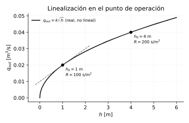

# Modelado de sistemas físicos: cómo llegar a la $G(s)$ de *tu* sistema

*Capítulo agregado a partir de una segunda evaluación del curso, con una
pregunta concreta como guía: un estudiante que quiere usar electrónica
para medir y controlar sistemas reales — mecánicos, químicos, eléctricos —
¿qué le falta para poder hacerlo?*

*La primera respuesta es esta: todo el curso trabaja sobre funciones de
transferencia **que ya vienen dadas**. El único modelado que aparece es el
circuito RC del capítulo 3. Pero frente a un horno, un tanque o un motor
real, el primer problema no es diseñar el controlador — es conseguir la
$G(s)$.*

## El método, en cuatro pasos

Sirve igual para cualquier dominio:

1. **Elegir entrada y salida.** ¿Qué variable puedo manipular? ¿Cuál quiero
   controlar? (motor: entrada voltaje, salida velocidad).
2. **Escribir la ley física** que las relaciona: Newton, Kirchhoff, balance
   de energía, balance de masa. Sale una ecuación diferencial.
3. **Aplicar Laplace** con condiciones iniciales nulas (derivar $\to$
   multiplicar por $s$, como en el capítulo 2).
4. **Despejar** $G(s) = \text{salida}(s)/\text{entrada}(s)$.

Lo importante del paso 2 es que casi siempre se reduce a la misma
estructura: **algo que acumula** y **algo que disipa**.

## Los cuatro dominios, el mismo sistema

### Eléctrico — circuito RC

Ya desarrollado en el capítulo 3. Kirchhoff sobre la malla:

$$
RC\,\frac{dv_C}{dt} + v_C = v_{in}
\qquad\Longrightarrow\qquad
G(s) = \frac{1}{RCs+1}
$$

### Mecánico rotacional — inercia con fricción

Segunda ley de Newton para rotación ($\sum \tau = J\dot\omega$), con
fricción viscosa $b\,\omega$:

$$
J\,\frac{d\omega}{dt} + b\,\omega = \tau
\qquad\Longrightarrow\qquad
\frac{\Omega(s)}{\mathrm{T}(s)} = \frac{1}{Js+b}
= \frac{1/b}{(J/b)s+1}
$$

### Térmico — un horno

Balance de energía: lo que entra menos lo que se escapa al ambiente es lo
que se acumula en la masa térmica. Con $\theta = T - T_{amb}$ (temperatura
por encima del ambiente), capacitancia térmica $C_t$ [J/K] y resistencia
térmica de las paredes $R_t$ [K/W]:

$$
C_t\,\frac{d\theta}{dt} = q - \frac{\theta}{R_t}
\qquad\Longrightarrow\qquad
R_tC_t\,\frac{d\theta}{dt} + \theta = R_t\,q
\qquad\Longrightarrow\qquad
G(s) = \frac{R_t}{R_tC_t\,s+1}
$$

### Fluidos — nivel de un tanque

Balance de masa: lo que entra menos lo que sale es lo que sube el nivel.
Con área $A$ y una válvula de salida de resistencia $R_h$ (por ahora
lineal, $q_{out}=h/R_h$):

$$
A\,\frac{dh}{dt} = q_{in} - \frac{h}{R_h}
\qquad\Longrightarrow\qquad
A R_h\,\frac{dh}{dt} + h = R_h\,q_{in}
\qquad\Longrightarrow\qquad
G(s) = \frac{R_h}{AR_h\,s+1}
$$

### La misma ecuación, cuatro veces

Los cuatro resultados son $\dfrac{K}{\tau s+1}$. No es casualidad — en
todos hay un elemento que **acumula** y uno que **disipa**:

| Dominio | Potencial | Flujo | Acumula (C) | Disipa (R) | $\tau$ |
|---|---|---|---|---|---|
| Eléctrico | voltaje $v$ [V] | corriente $i$ [A] | capacitancia $C$ [F] | resistencia $R$ [$\Omega$] | $RC$ |
| Térmico | temperatura $\theta$ [K] | calor $q$ [W] | masa térmica $C_t$ [J/K] | aislación $R_t$ [K/W] | $R_tC_t$ |
| Fluidos | nivel $h$ [m] | caudal $q$ [m³/s] | área $A$ [m²] | válvula $R_h$ [s/m²] | $AR_h$ |
| Mecánico rot. | velocidad $\omega$ [rad/s] | torque $\tau$ [N·m] | inercia $J$ [kg·m²] | fricción $b$ [N·m·s] | $J/b$ |

**Por qué esto importa tanto en la práctica**: aprender a modelar *un*
dominio alcanza para los cuatro. Y al revés — la intuición que uno ya
tiene de un capacitor cargándose (rápido al principio, cada vez más lento,
llega al 63 % en una constante de tiempo) es **exactamente** la misma
intuición que sirve para un horno calentando o un tanque llenándose.

**De dónde salen los sistemas de 2.º orden**: cuando hay **dos** elementos
que acumulan energía y se la pasan entre sí (masa + resorte, inductancia +
capacitancia, dos tanques en cascada). Ahí aparece la posibilidad de
oscilar, que un sistema de primer orden nunca tiene.

## El caso completo: motor DC

Es el ejemplo más útil para quien quiere hacer control con electrónica,
porque **acopla dos dominios**: un circuito eléctrico que produce torque, y
una mecánica que gira y a su vez genera voltaje de vuelta.

**Lado eléctrico** (Kirchhoff en la armadura), donde $e = K_e\,\omega$ es
la fuerza contraelectromotriz — el motor, al girar, se comporta también
como generador:

$$
v = R_a\,i + L_a\,\frac{di}{dt} + K_e\,\omega
$$

**Lado mecánico**, donde el torque es proporcional a la corriente
($\tau = K_t\,i$):

$$
J\,\frac{d\omega}{dt} + b\,\omega = K_t\,i
$$

En Laplace y eliminando $I(s)$:

$$
\boxed{\;
\frac{\Omega(s)}{V(s)} = \frac{K_t}{(L_as+R_a)(Js+b) + K_tK_e}
\;}
$$

La figura muestra algo que la fórmula esconde: **el motor ya tiene un lazo
de realimentación adentro**, el de la fem contraelectromotriz. Es
realimentación negativa natural, y es la razón de que un motor DC en lazo
abierto sea razonablemente estable y no se dispare.

### La simplificación que casi siempre se hace

Con valores de un motor chico típico:

$$
R_a = 1.2\,\Omega \quad
L_a = 1.5\,\text{mH} \quad
K_t = K_e = 0.045 \quad
J = 2.5\times10^{-5}\,\text{kg·m}^2 \quad
b = 1.2\times10^{-5}
$$

Las dos constantes de tiempo salen muy separadas:

$$
\tau_{el} = \frac{L_a}{R_a} = 1.25\;\text{ms}
\qquad\text{vs.}\qquad
\tau_{mec} \approx 14.7\;\text{ms}
$$

La eléctrica es **12 veces más rápida**. Por el criterio del polo
dominante (capítulo 6: un polo 5 veces más lejos ya casi no impacta), se
puede despreciar $L_a$:

$$
\frac{\Omega(s)}{V(s)} \approx \frac{K_t}{R_a(Js+b)+K_tK_e}
= \frac{K}{\tau s+1}
\qquad
K = \frac{K_t}{R_ab+K_tK_e}
\qquad
\tau = \frac{R_aJ}{R_ab+K_tK_e}
$$

Con esos números: $K = 22.07\;\text{(rad/s)/V}$ y $\tau = 14.7\;\text{ms}$.

**Un motor DC es, para efectos de control de velocidad, un sistema de
primer orden** — el mismo $K/(\tau s+1)$ del horno y del tanque. Este
modelo es el que se usa en el proyecto integrador (capítulo 16).

*(Honestidad sobre la aproximación: el polo dominante del modelo completo
de 2.º orden está en $-75$, y el del simplificado en $-68$ — un 10 % de
diferencia. Alcanza de sobra para diseñar el lazo, pero conviene saber que
está ahí.)*

## Linealización: el paso que hace que todo lo anterior aplique

Toda la teoría del curso vale para sistemas **lineales**. Los sistemas
reales casi nunca lo son. La salvación es que **alrededor de un punto de
operación**, una curva suave se parece a su recta tangente.

Volviendo al tanque, pero con la válvula real: el caudal de salida no es
$h/R$, es $q_{out}=k\sqrt{h}$ (Torricelli). La ecuación queda no lineal:

$$
A\,\frac{dh}{dt} = q_{in} - k\sqrt{h}
$$

**Procedimiento**: se elige un punto de operación $(h_0, q_{in0})$ en
equilibrio ($q_{in0}=k\sqrt{h_0}$), se escriben las variables como
desviaciones respecto de ese punto ($h = h_0+\delta h$), y se reemplaza la
parte no lineal por su tangente:

$$
k\sqrt{h} \;\approx\; k\sqrt{h_0} + \underbrace{\frac{k}{2\sqrt{h_0}}}_{\text{pendiente}}\,\delta h
$$

Restando el equilibrio queda, otra vez, un sistema de primer orden:

$$
A\,\frac{d\,\delta h}{dt} + \frac{1}{R}\,\delta h = \delta q_{in}
\qquad\text{con}\qquad
R = \frac{2\sqrt{h_0}}{k}
\qquad\Longrightarrow\qquad
\tau = AR = \frac{2A\sqrt{h_0}}{k}
$$

**La consecuencia práctica, que es el punto del capítulo**: $R$ (y por lo
tanto $\tau$) **depende del punto de operación**. Con $A=0.5$ m² y
$k=0.02$:

| $h_0$ | $R$ | $\tau$ |
|---|---|---|
| 1 m | 100 s/m² | 50 s |
| 4 m | 200 s/m² | 100 s |

El mismo tanque es **el doble de lento** operando a 4 m que a 1 m. Un PID
sintonizado a un nivel va a responder distinto al otro — y eso no es una
falla del PID, es que el modelo cambió. Es la razón por la que en la
industria se resintoniza por rango de operación, o se usa *gain
scheduling* (cambiar las ganancias según el punto de trabajo).

## Ejercicios propuestos

**14.1** Un horno tiene masa térmica $C_t=800$ J/K y resistencia térmica
de paredes $R_t=0.25$ K/W. (a) Escribir $G(s)=\theta(s)/Q(s)$. (b) ¿Cuánto
vale la constante de tiempo, en minutos? (c) Si la resistencia calefactora
entrega 1500 W constantes, ¿en cuánto se estabiliza la temperatura por
encima del ambiente?

**14.2** Dos tanques idénticos en cascada (la salida del primero alimenta
al segundo), cada uno con $A=0.3$ m² y $R_h=150$ s/m². Escribir la función
de transferencia $H_2(s)/Q_{in}(s)$ y decir si el sistema puede oscilar.
Justificar con la ubicación de los polos.

**14.3** Para el motor DC de este capítulo, calcular la velocidad en
estado estable con 12 V aplicados, en rad/s y en RPM. ¿Cuánto tarda en
llegar al 95 % de esa velocidad?

**14.4** Un tanque con válvula de Torricelli ($k=0.05$, $A=1.2$ m²) opera
a $h_0=2.25$ m. (a) Calcular el caudal de entrada necesario para mantener
ese nivel. (b) Linealizar y dar $\tau$. (c) Repetir para $h_0=0.25$ m y
comparar.

**14.5** *(conceptual)* Un motor con la misma $J$ pero el **doble** de
fricción $b$: ¿el sistema se vuelve más rápido o más lento? ¿Y la ganancia
$K$ sube o baja? Explicar físicamente, sin hacer cuentas.

### Respuestas

**14.1** (a) $G(s)=\dfrac{0.25}{200s+1}$. (b) $\tau=R_tC_t=200$ s $=3.3$
min. (c) $\theta_{ss}=R_t q=0.25\times1500=375$ K por encima del ambiente.

**14.2** $\dfrac{H_2}{Q_{in}}=\dfrac{R_h}{(AR_hs+1)^2}=\dfrac{150}{(45s+1)^2}$.
Polos reales dobles en $s=-1/45$ — **no puede oscilar** (haría falta un
par complejo conjugado; dos tanques en cascada sin realimentación entre
ellos siempre dan polos reales).

**14.3** $\omega_{ss}=K\cdot V=22.07\times12=265$ rad/s $=2530$ RPM. El
95 % se alcanza en $3\tau\approx44$ ms.

**14.4** (a) $q_{in0}=k\sqrt{h_0}=0.05\times1.5=0.075$ m³/s.
(b) $R=2\sqrt{h_0}/k=2(1.5)/0.05=60$ s/m², $\tau=AR=72$ s.
(c) A $h_0=0.25$: $R=20$ s/m², $\tau=24$ s — tres veces más rápido, porque
a menor altura la válvula "resiste" menos en términos incrementales.

**14.5** Más fricción $\Rightarrow$ $\tau=J/b$ **baja**: el motor frena
antes, llega más rápido a su velocidad final. Pero $K$ también **baja**:
esa velocidad final es menor, porque parte del torque se gasta venciendo
fricción. Es el compromiso típico — un sistema más amortiguado es más
rápido de estabilizar pero entrega menos.
