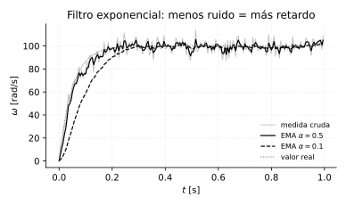
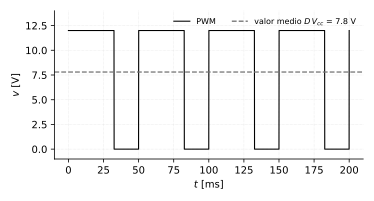

# La cadena de instrumentación: cómo la electrónica entra al lazo

*Segundo capítulo agregado desde la perspectiva de quien quiere **hacer**
control, no solo calcularlo. El curso trabaja con diagramas de bloques
donde el controlador "mide $y$" y "aplica $u$". Este capítulo abre esas dos
flechas: qué circuito hay adentro, qué distorsiona cada etapa y qué
números hay que mirar para elegir componentes.*

## El lazo real, componente por componente


Un lazo de control digital físico siempre tiene la misma estructura. En el
camino de **medición** (de la planta hacia el microcontrolador):

| Etapa | Qué hace | Qué puede arruinar |
|---|---|---|
| **Sensor** | convierte la variable física en eléctrica | no linealidad, deriva térmica, su propia dinámica |
| **Acondicionamiento** | amplifica y desplaza al rango del ADC | ruido si la ganancia es alta, saturación del amplificador |
| **Filtro antialiasing** | corta lo que está arriba de $f_s/2$ | si falta, hay *aliasing* irreparable (cap. 13) |
| **ADC** | muestrea y cuantiza | resolución finita, tiempo de conversión |

Y en el camino de **actuación** (del microcontrolador hacia la planta):

| Etapa | Qué hace | Qué puede arruinar |
|---|---|---|
| **PWM** | genera la señal de control como ciclo de trabajo | resolución del duty, frecuencia mal elegida |
| **Driver / puente H** | da la potencia que el micro no puede | caída de tensión, zona muerta, tiempo muerto |
| **Actuador** | convierte energía eléctrica en acción física | saturación, fricción estática |

**La idea central del capítulo**: el modelo $G(s)$ que se diseñó en el
papel es el de la *planta*. El lazo real controla **planta + toda esta
cadena**. Cada etapa agrega ganancia, retardo o límites que hay que
conocer, porque se meten dentro del lazo y afectan la estabilidad.

## Sensores: qué mide qué

| Variable | Sensor típico | Salida | Nota |
|---|---|---|---|
| Posición angular | encoder incremental | pulsos A/B | se cuenta, no se convierte con ADC |
| Posición angular | potenciómetro | voltaje | absoluto, pero con desgaste |
| Velocidad | encoder + conteo por tiempo | pulsos | resolución limitada (abajo) |
| Temperatura | termopar / RTD / NTC | mV / resistencia | termopar necesita mucha amplificación |
| Corriente | resistencia shunt / efecto Hall | mV / V | el shunt sirve para medir torque del motor |
| Nivel | presión diferencial / ultrasónico | mA / voltaje | el lazo 4–20 mA es el estándar industrial |
| Presión | celda piezorresistiva | mV | típicamente en puente de Wheatstone |

**Por qué 4–20 mA y no 0–5 V en la industria**: una corriente no se cae
por la resistencia del cable (lo que sale del sensor es lo que llega), y
el cero vivo en 4 mA permite distinguir "medida cero" de "cable cortado" —
si llegan 0 mA, hay una falla, no un valor válido. Es diagnóstico gratis.

### El encoder y su resolución de velocidad

Es el caso que más cuesta en la práctica, porque la resolución **no es un
dato del encoder**, depende de cómo se mide.

Un encoder de $P$ pulsos por vuelta leído en cuadratura (los flancos de
los dos canales A y B) da $4P$ cuentas por vuelta. Si se cuentan pulsos
durante un intervalo $\Delta t$, la velocidad más chica que se puede
distinguir es **una cuenta** en ese intervalo:

$$
\boxed{\;
\Delta\omega = \frac{2\pi}{4P\cdot \Delta t}\;\text{[rad/s]}
\;}
$$

Con $P=500$ y $\Delta t = 5$ ms: $4P = 2000$ cuentas/vuelta, y

$$
\Delta\omega = \frac{2\pi}{2000 \times 0.005} = 0.628\;\text{rad/s}
$$

**El compromiso que esto plantea**: muestrear más rápido (bajar $\Delta t$)
mejora el control pero **empeora la resolución de velocidad**, porque
entran menos pulsos en cada ventana. Es un conflicto real que aparece en
todo proyecto de control de velocidad, y se resuelve de tres maneras:
encoder de más pulsos, medir el *periodo* entre pulsos en vez de contarlos
(bueno a baja velocidad, malo a alta), o filtrar.

## Acondicionamiento y ADC

El ADC tiene un rango fijo (típicamente 0–3.3 V o 0–5 V) y $n$ bits. El
trabajo del acondicionamiento es que la señal **use todo ese rango**:

$$
\Delta = \frac{V_{ref}}{2^n}
$$

Para un ADC de 10 bits sobre 5 V: $\Delta = 5/1024 = 4.88$ mV. Si el
sensor entrega apenas 0–50 mV, se está usando el 1 % del rango, y la
medida efectiva tiene unos **3 bits útiles**, no 10. Amplificar $\times 100$
antes del ADC recupera esos 7 bits — no es un lujo, es la diferencia entre
una medida usable y una inservible.

De ahí la fórmula del capítulo 13, $\text{SNR}\approx 6.02n+1.76$ dB: cada
bit vale 6 dB, y desperdiciar rango es tirar bits.

### Filtrado digital: el filtro exponencial (EMA)

Después del ADC casi siempre hace falta suavizar. El filtro más usado en
microcontroladores es el exponencial de primer orden, porque necesita
**una sola variable de memoria**:

$$
y(k) = \alpha\,x(k) + (1-\alpha)\,y(k-1)
\qquad 0<\alpha\le1
$$

```python
y = alpha*x + (1-alpha)*y      # una línea, un float de estado
```

Es exactamente un sistema de primer orden discreto — se puede analizar con
todo lo del capítulo 4. Su función de transferencia y su constante de
tiempo equivalente:

$$
H(z) = \frac{\alpha}{1-(1-\alpha)z^{-1}}
\qquad\qquad
\tau_f \approx \frac{T}{\alpha}
$$



**El compromiso, que es el punto**: $\alpha$ chico filtra mucho ruido pero
agrega **retardo**, y el retardo dentro de un lazo cerrado **come margen
de fase** (capítulo 12) — puede volver inestable un lazo que en el papel
era estable. Regla práctica: $\tau_f$ al menos 5–10 veces más rápida que
la constante de tiempo dominante de la planta.

## Actuación: el PWM es el DAC que realmente se usa

Casi ningún microcontrolador tiene un DAC decente, pero todos tienen PWM.
Una señal cuadrada de frecuencia fija y ancho variable, aplicada a una
carga inductiva (un motor) o filtrada, entrega un valor medio:

$$
\bar{v} = D\cdot V_{cc}
\qquad
D = \frac{t_{on}}{T_{pwm}}
$$



**Por qué funciona**: la propia planta es un pasabajas. El motor del
capítulo 14 tiene $\tau=14.7$ ms; una PWM a 20 kHz ($T_{pwm}=50\,\mu$s) es
mil veces más rápida que eso — la inercia mecánica no alcanza a "ver" el
rizado, solo el promedio. **Esa es la regla de elección de frecuencia**:
$f_{pwm} \gg 1/\tau_{planta}$. (El otro criterio, para motores, es estar
arriba de 20 kHz para que el zumbido no sea audible.)

**Resolución del PWM**: con un contador de $m$ bits hay $2^m$ valores de
duty. En muchos micros hay un compromiso directo — subir $f_{pwm}$ reduce
los bits disponibles, porque el contador tiene menos tiempo de contar.

**Lo que el driver agrega al modelo**: un puente H tiene caída de tensión
en los transistores (típicamente 0.5–2 V), **zona muerta** (con duty muy
chico el motor no arranca por fricción estática) y **saturación**
(no puede dar más que $V_{cc}$). La saturación es la que importa para el
control: es la causa del *windup* del integrador (capítulo 5) y aparece en
la simulación del capítulo 16.

## Cómo elegir el periodo de muestreo

Nyquist ($f_s > 2f_{max}$) es el **mínimo absoluto** para no perder
información — pero muestrear al mínimo de Nyquist da un control pésimo. La
regla de ingeniería para control es mucho más exigente:

$$
\boxed{\;
T \approx \frac{\tau_{dom}}{10}\;\text{a}\;\frac{\tau_{dom}}{20}
\;}
$$

Para el motor ($\tau = 14.7$ ms) eso da entre 0.7 y 1.5 ms... y sin
embargo en el capítulo 16 se usa $T = 5$ ms. **Por qué**: porque
$\Delta t = T$ también fija la resolución del encoder, y a 1 ms la
resolución sería $3.14$ rad/s — cinco veces peor. $T=5$ ms es el
compromiso: todavía $\tau/3$, suficiente para el lazo, con resolución
aceptable.

Esta es exactamente la clase de decisión que no aparece en el diseño en
papel y define si el proyecto funciona o no.

**Qué pasa si $T$ es muy grande**: el retardo de muestreo (aproximable
como $e^{-sT/2}$, medio periodo) come margen de fase y puede desestabilizar
el lazo. Es el mismo mecanismo que el del filtro.

## Ejercicios propuestos

**15.1** Un encoder de 200 PPR en cuadratura se lee cada 10 ms.
(a) ¿Cuál es la resolución de velocidad en rad/s y en RPM? (b) Si se
quiere resolución mejor que 0.5 rad/s manteniendo $\Delta t$, ¿cuántos PPR
hacen falta como mínimo?

**15.2** Un termopar tipo K entrega 41 µV/°C y se quiere medir hasta
400 °C con un ADC de 12 bits y $V_{ref}=3.3$ V. (a) ¿Cuál es el voltaje de
fondo de escala del termopar? (b) ¿Qué ganancia hay que poner para usar
todo el rango del ADC? (c) Con esa ganancia, ¿cuántos °C vale un LSB?

**15.3** Una planta térmica tiene $\tau = 200$ s. (a) Elegir $T$ con la
regla $\tau/10$. (b) ¿Qué frecuencia de PWM haría falta como mínimo para
la resistencia calefactora? ¿Sirve una PWM de 1 Hz? Justificar.

**15.4** Se filtra una medida con EMA $\alpha = 0.2$ muestreando a
$T=2$ ms. (a) Calcular $\tau_f$. (b) Si la planta tiene $\tau=15$ ms,
¿cumple la regla de 5–10 veces? (c) Estimar el retardo de fase que agrega
a 10 Hz y comentar el riesgo.

**15.5** *(de diseño)* Se quiere controlar el nivel del tanque del
capítulo 14 ($\tau=50$ s) con un Arduino. Proponer la cadena completa:
sensor, acondicionamiento, resolución de ADC, $T$, tipo de actuador y
frecuencia de PWM. Justificar cada elección con un número.

### Respuestas

**15.1** (a) $4P=800$, $\Delta\omega = 2\pi/(800\times0.01)=0.785$ rad/s
$=7.5$ RPM. (b) Se necesita $4P \ge 2\pi/(0.5\times0.01)=1257$, o sea
$P\ge315$ — un encoder de 360 o 500 PPR.

**15.2** (a) $41\,\mu\text{V}\times400 = 16.4$ mV. (b) $G = 3.3/0.0164
\approx 200$. (c) $\Delta = 3.3/4096 = 0.806$ mV a la entrada del ADC, que
referido al termopar son $0.806/200 = 4.03\,\mu$V $= 0.098$ °C por LSB.

**15.3** (a) $T = 20$ s. (b) Basta con $f_{pwm}\gg 1/200 = 0.005$ Hz; una
PWM de 1 Hz es 200 veces más rápida que la planta, **sirve de sobra**. Es
por eso que en control térmico se usan PWM lentísimas (o incluso relés de
estado sólido conmutando por ciclos de red) — la inercia térmica promedia.

**15.4** (a) $\tau_f = T/\alpha = 0.002/0.2 = 10$ ms. (b) **No cumple**:
10 ms es comparable a los 15 ms de la planta, no 5–10 veces menor. El
filtro es casi tan lento como lo que se quiere controlar. (c) A 10 Hz
($\omega=62.8$ rad/s), el atraso de un polo en $1/\tau_f=100$ rad/s es
$\arctan(62.8/100)=32°$ — se pierde un tercio del margen de fase típico de
diseño. Hay que subir $\alpha$ o bajar $T$.

**15.5** Una solución razonable: sensor de presión diferencial 4–20 mA
(robusto, apto para líquido); acondicionamiento con resistencia de 250 Ω
para convertir 4–20 mA en 1–5 V; ADC de 10 bits del Arduino sobre 5 V
$\Rightarrow$ $\Delta=4.88$ mV, que sobre 4 V útiles y 6 m de rango da
7.3 mm de resolución — más que suficiente; $T=5$ s ($\tau/10$); actuador:
bomba con driver PWM o válvula proporcional; $f_{pwm}$ de 100 Hz sobra
($\gg 1/50$ Hz). Nótese que con una planta tan lenta **ninguna** de las
limitaciones electrónicas aprieta — el caso difícil siempre es la planta
rápida.
