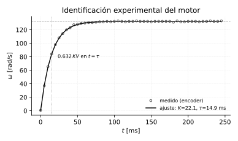
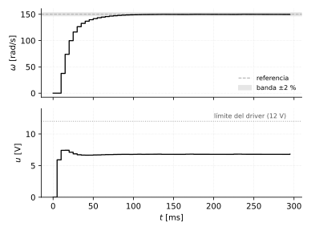

# Proyecto integrador: control digital de velocidad de un motor DC

*Capítulo final agregado. Junta todo lo anterior en un solo proyecto
ejecutable: modelar (cap. 14), instrumentar (cap. 15), **identificar
experimentalmente**, diseñar el controlador (cap. 5 y 12), discretizarlo
(cap. 4 y 13) y verificar con las limitaciones reales puestas. Todo el
código es Python con la librería `control`; el lazo final es el mismo
`for` que se programaría en el microcontrolador.*

## El problema

Controlar la velocidad de un motor DC a una referencia de 150 rad/s
($\approx$ 1430 RPM), con:

- alimentación y driver de **12 V** (saturación dura),
- encoder incremental de **500 PPR** en cuadratura,
- microcontrolador con PWM y temporizador.

Especificación: error estacionario nulo, sin sobrepaso (es un motor con
carga mecánica, el sobrepaso de velocidad no se quiere), y establecimiento
en menos de 150 ms.

## Paso 1 — Identificación experimental

El modelo teórico del capítulo 14 dio $K=22.07$ y $\tau=14.7$ ms **a
partir de la hoja de datos**. En la práctica esos datos no están, o están
mal, o el motor tiene una carga acoplada que cambia $J$ y $b$. El modelo
hay que **medirlo**.

**El ensayo** (es el método de la respuesta al escalón del capítulo 7,
hecho en serio):

1. Motor libre, parado.
2. Aplicar un escalón de voltaje conocido (6 V — la mitad del rango, para
   no saturar y quedarse en zona lineal).
3. Registrar $\omega(k)$ con el encoder cada $T=5$ ms durante 250 ms.
4. Ajustar el modelo $\omega(t)=KV(1-e^{-t/\tau})$ a los datos.

```python
import numpy as np
from scipy.optimize import curve_fit

V = 6.0
def modelo(t, K, tau):
    return K*V*(1 - np.exp(-t/tau))

# t, w_medido vienen del ensayo (o del archivo de datos del micro)
(K, tau), _ = curve_fit(modelo, t, w_medido, p0=[10, 0.05])
print(f"K = {K:.2f} (rad/s)/V,  tau = {tau*1000:.1f} ms")
```



Simulando el ensayo con ruido realista y la cuantización del encoder, el
ajuste recupera **$K = 22.08$ y $\tau = 14.9$ ms** — error del 0.0 % en la
ganancia y 1.1 % en la constante de tiempo, con un RMSE del 0.34 %.

**Por qué ajustar por mínimos cuadrados y no leer el 63 % del gráfico**:
el método gráfico usa *dos* puntos (el valor final y el instante del
63 %), y los dos están contaminados por ruido. `curve_fit` usa las 50
muestras a la vez, así que el ruido se promedia. Es la diferencia entre un
modelo con 10 % de error y uno con 1 %.

**Precauciones del ensayo**, que no son obvias y arruinan la medición:

- **No saturar**: si el escalón lleva el motor contra el límite del
  driver, la respuesta deja de ser de primer orden.
- **Partir del reposo** y esperar a que se estabilice antes de cortar.
- **Repetir en ambos sentidos** de giro y promediar: la fricción no es
  simétrica.
- **Identificar con la carga puesta**, no en vacío. El motor solo y el
  motor con la carga acoplada son dos plantas distintas.

## Paso 2 — Elegir el periodo de muestreo

Como se discutió en el capítulo 15, hay dos criterios que tiran en
direcciones opuestas:

| Criterio | Pide | Resultado |
|---|---|---|
| Dinámica del lazo ($\tau/10$ a $\tau/20$) | $T$ chico | $T \le 1.5$ ms |
| Resolución del encoder ($2\pi/4P\Delta t$) | $T$ grande | $T=1$ ms $\to$ 3.14 rad/s |

**Decisión: $T = 5$ ms.** Da $\tau/3$, suficiente para el lazo, con una
resolución de velocidad de $0.628$ rad/s — el 0.4 % de la referencia de
150 rad/s. Es un compromiso explícito, no un valor arbitrario.

**Modelo discreto de la planta** (ZOH sobre $K/(\tau s+1)$, cap. 4):

$$
\omega(k) = a\,\omega(k-1) + b\,u(k-1)
\qquad
a = e^{-T/\tau} = 0.712
\qquad
b = K(1-a) = 6.36
$$

## Paso 3 — Diseñar el PI

Se elige **PI, sin acción derivativa**. El porqué: la medida de velocidad
viene de contar pulsos, y es **ruidosa por construcción** (la cuantización
es ruido). Derivar ruido lo amplifica — es el caso de manual donde la $D$
hace más daño que bien. Y el integrador es obligatorio: sin él queda error
estacionario (cap. 9), porque la planta es tipo 0.

**Diseño por cancelación de polo**. Con
$G_c(s) = K_p + \dfrac{K_i}{s} = \dfrac{K_p\left(s + K_i/K_p\right)}{s}$,
si se elige el cero justo encima del polo de la planta:

$$
\frac{K_i}{K_p} = \frac{1}{\tau}
\qquad\Longrightarrow\qquad
K_p = K_i\,\tau
$$

el lazo abierto queda en un integrador puro, $L(s) = \dfrac{K_pK}{\tau s}$,
y el lazo cerrado en un **primer orden limpio**:

$$
\frac{\Omega}{R} = \frac{1}{\dfrac{\tau}{K_pK}s+1}
\qquad
\tau_{lc} = \frac{\tau}{K_pK}
$$

Primer orden $\Rightarrow$ **cero sobrepaso garantizado**, que es lo que
pedía la especificación. Eligiendo $K_i = 2.0$:

$$
K_p = 2.0 \times 0.01471 = 0.0294
\qquad
\tau_{lc} = \frac{0.01471}{0.0294\times22.07} = 22.7\;\text{ms}
$$

$$
t_s(2\%) = 4\,\tau_{lc} = 91\;\text{ms} \;<\; 150\;\text{ms} \quad\checkmark
$$

```python
import control as ct

K, tau = 22.07, 0.01471
Kp, Ki = 0.0294, 2.0

G  = ct.tf([K], [tau, 1])
Gc = ct.tf([Kp, Ki], [1, 0])
L  = ct.feedback(Gc*G, 1)
print(L.poles())          # [-67.9, -44.2]  reales -> sin oscilación
```

Los polos salen en $-67.9$ (el que casi se cancela con el cero) y $-44.2$
$= 1/\tau_{lc}$ — ambos **reales**, confirmando la respuesta sin sobrepaso.

**Advertencia sobre cancelar polos** (la misma del dead-beat, cap. 13): la
cancelación nunca es exacta, porque $\tau$ se midió con 1 % de error. Lo
que queda es un polo residual muy cerca del cero, que aporta una dinámica
lenta y débil. Aquí es inofensivo; con un polo de planta **inestable** o
muy lento, cancelar sería peligroso y habría que diseñar de otra forma.

## Paso 4 — El código que corre en el micro

Se discretiza el PI en **forma incremental** (cap. 13), que hace trivial
el anti-windup: si la salida satura, simplemente no se acumula.

$$
\Delta u(k) = K_p\big[e(k)-e(k-1)\big] + K_i T\,e(k)
$$

```python
Kp, Ki, T = 0.0294, 2.0, 0.005
RES = 0.628            # resolucion del encoder [rad/s]
r   = 150.0            # referencia

for k in range(1, N):
    w_med = round(w[k-1]/RES)*RES              # lo que el encoder puede ver
    e[k]  = r - w_med
    du    = Kp*(e[k]-e[k-1]) + Ki*T*e[k]       # PI incremental
    u[k]  = np.clip(u[k-1] + du, 0, 12)        # saturacion = anti-windup
    w[k]  = a*w[k-1] + b*u[k-1]                # <- en el micro, esto es el motor real
```

Las únicas tres líneas que cambian al pasar al hardware: `w_med` sale de
leer el contador del encoder, `u[k]` se escribe como duty
($D = u/12$) en el registro del PWM, y la última línea desaparece — la
hace el motor.

## Paso 5 — Verificación con todas las limitaciones puestas



| Resultado | Valor | Especificación |
|---|---|---|
| Sobrepaso | 0.0 % | sin sobrepaso $\checkmark$ |
| $t_s$ (2 %) | 75 ms | $<150$ ms $\checkmark$ |
| Esfuerzo máximo $u$ | 7.43 V | $<12$ V $\checkmark$ — no satura |
| Error final | 0.25 rad/s | — |

**El resultado más instructivo es el último.** El error no baja de
$\approx0.25$ rad/s aunque el integrador siga trabajando. La razón no es
el controlador: la resolución del encoder es 0.628 rad/s, y **medio paso
de cuantización es 0.314 rad/s**. El sistema no puede corregir un error
que no puede medir.

Aquí está la lección que justifica los capítulos 14 y 15 enteros:

> **La precisión de un lazo de control está acotada por la precisión de su
> sensor, no por lo bueno que sea el controlador.**

Subir $K_i$, agregar $D$ o cambiar de algoritmo no mejora este número. Lo
único que lo mejora es un encoder de más pulsos, una ventana de medición
más larga, o medir periodo en vez de contar pulsos. Es un límite de
**instrumentación**, y por eso el diseño del lazo y el de la electrónica
no son dos problemas separados.

*(Nota: el esfuerzo pico de 7.43 V confirma que el diseño tiene margen —
si hubiera saturado en 12 V, la respuesta real sería más lenta que la
calculada y habría que rediseñar con menos ganancia o aceptar el
transitorio limitado por el actuador.)*

## Ejercicios propuestos

**16.1** Rehacer el diseño del paso 3 para $K_i = 4.0$. (a) ¿Cuánto vale
$K_p$? (b) ¿Cuál es el nuevo $t_s$? (c) Simular y verificar si el esfuerzo
de control se mantiene por debajo de 12 V. ¿Qué precio se paga por la
velocidad?

**16.2** Repetir la simulación del paso 5 con una referencia de
250 rad/s. (a) ¿Satura el driver? (b) Verificar que el anti-windup de la
forma incremental funciona: comparar contra una versión posicional sin
anti-windup y comentar la diferencia.

**16.3** Agregar al modelo una **perturbación de carga**: a los 100 ms, un
torque que equivale a restar 30 rad/s. (a) ¿Cuánto cae la velocidad?
(b) ¿En cuánto tiempo se recupera? (c) ¿Qué pasaría si el controlador
fuera solo proporcional ($K_i=0$)?

**16.4** Rehacer el proyecto completo con un encoder de **100 PPR** en vez
de 500. (a) Nueva resolución. (b) Nuevo error final esperado. (c) ¿Alcanza
con bajar $T$ para compensar? Cuantificar.

**16.5** *(integrador)* Adaptar el proyecto a **control de posición** en
vez de velocidad. (a) ¿Cómo cambia $G(s)$? (Pista: la posición es la
integral de la velocidad.) (b) ¿Sigue haciendo falta el integrador del PI
para error estacionario nulo ante un escalón? (c) ¿Por qué ahora sí puede
convenir la acción derivativa?

### Respuestas

**16.1** (a) $K_p = 4.0\times0.01471 = 0.0588$. (b)
$\tau_{lc} = 0.01471/(0.0588\times22.07) = 11.3$ ms, $t_s = 45$ ms — la
mitad. (c) El esfuerzo inicial se duplica aproximadamente
($\approx 14$ V pedidos), así que **sí satura**. El precio de duplicar la
velocidad es que el actuador ya no alcanza: la respuesta real queda
limitada por los 12 V y es más lenta que los 45 ms calculados. Es el
compromiso universal — la velocidad de respuesta la paga el actuador.

**16.2** (a) Sí: en estado estable hacen falta $250/22.07 = 11.3$ V, y el
transitorio pide más. (b) Con forma incremental y `clip`, $u$ se queda
pegado en 12 V y sale en cuanto el error se reduce. Con forma posicional
sin anti-windup, la suma acumulada sigue creciendo mientras satura, y al
llegar a la referencia el integrador tarda en "descargarse" $\to$
sobrepaso grande y largo. Es exactamente el *windup* del capítulo 5.

**16.3** (a) El pico de caída depende de la velocidad del lazo; con
$\tau_{lc}=22.7$ ms la caída es de unos pocos rad/s antes de que el
integrador reaccione. (b) Se recupera en $\approx 4\tau_{lc} \approx
90$ ms. (c) Con $K_i=0$ quedaría **error permanente** ante la
perturbación: el proporcional necesita error para dar salida, así que la
velocidad se estabilizaría por debajo de la referencia y ahí se quedaría.
Es el argumento más convincente a favor del término integral.

**16.4** (a) $4P=400$, $\Delta\omega = 2\pi/(400\times0.005) = 3.14$ rad/s.
(b) Error final $\approx 1.57$ rad/s — **cinco veces peor**, y ya es el
1 % de la referencia. (c) **No**: bajar $T$ empeora la resolución
(es $\propto 1/\Delta t$). Bajar a $T=2.5$ ms daría 6.28 rad/s, el doble
de malo. Con un encoder pobre hay que ir para el otro lado — ventana de
medición más larga que el periodo de control, o medición de periodo.

**16.5** (a) Se agrega un integrador: $G(s)=\dfrac{K}{s(\tau s+1)}$ — la
planta pasa a ser **tipo 1**. (b) **No**: siendo tipo 1, un P puro ya da
error cero ante escalón de posición (cap. 9). El integrador solo haría
falta para seguir una rampa sin error, o para rechazar perturbaciones
constantes. (c) Porque la planta ahora tiene dos polos y **puede oscilar**;
la acción derivativa agrega amortiguamiento. Y el ruido ya no es el mismo
problema: la posición del encoder es una cuenta exacta, no una estimación
por diferencia — es mucho menos ruidosa que la velocidad.
